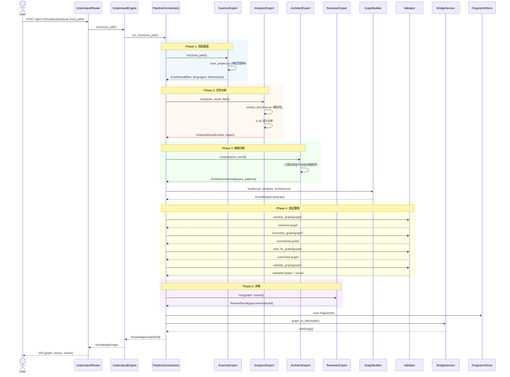
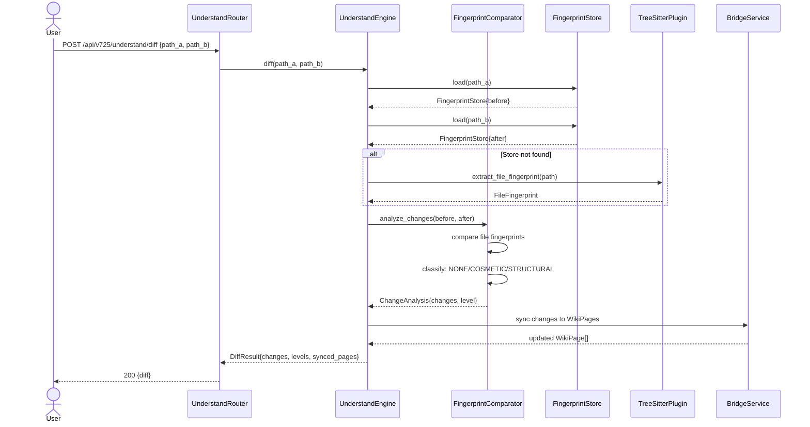
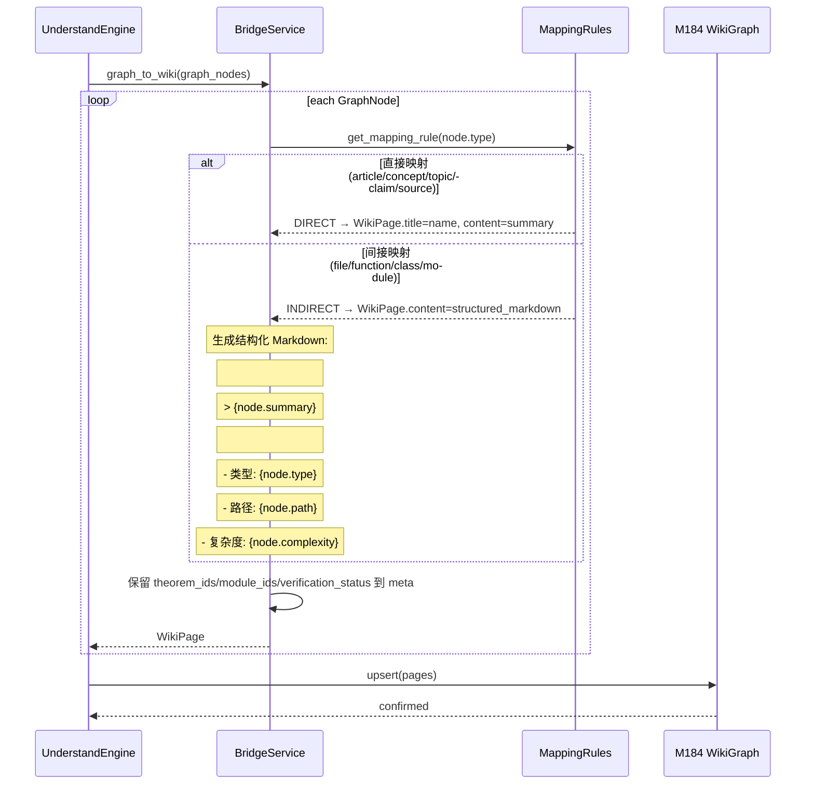

# 太乙AGI v7.25 系统架构设计：Understand Anything 概念移植

> **版本**: v7.25-arch-draft  
> **日期**: 2026-05-27  
> **架构师**: 高见远（Gao）  
> **基于**: PRD_v725_Understand_Anything.md + UA v2.7.3 源码分析  

---

## 1. 实现方案 + 框架选型

### 1.1 核心技术挑战

| # | 挑战 | 难度 | 应对策略 |
|---|-------|------|----------|
| C1 | UA 是 TypeScript Obsidian 插件，无法直接引入 | ★★★ | 概念移植+Python重实现：仅移植数据模型、验证管线、算法逻辑，不移植 UI/插件框架 |
| C2 | 21 种 NodeType + 35 种 EdgeType 的知识图谱 Schema 远超 M184 单节点 WikiPage | ★★★ | GraphNode→WikiPage 桥接层：直接映射(article/concept→WikiPage) + 间接映射(function/class→结构化 Markdown) |
| C3 | 4 层验证管线(sanitize→normalize→autoFix→validate)需忠实在 Python 中复现 | ★★ | 使用 Python dataclass + Pydantic 校验 + 完整别名表移植 |
| C4 | Tree-sitter 确定性代码分析需 Python binding | ★★ | tree-sitter==0.24.0 + tree-sitter-python==0.23.6，MJS 脚本逻辑用 Python 脚本替代 |
| C5 | 7 个专家 Agent 的协调调度 | ★★ | 复用太乙AGI 现有 Agent 调度框架，新增 understand-* Agent 注册 |
| C6 | M184 WikiGraph 向后兼容 | ★★★ | WikiPage 保留原有字段，新增 `meta.graph_node_id` 关联字段；桥接层双向转换 |

### 1.2 框架选型

| 层次 | 选型 | 版本 | 理由 |
|------|------|------|------|
| 语言 | Python | 3.11+ | 太乙AGI 技术栈统一 |
| 数据校验 | Pydantic | v2 | 替代 UA 的 Zod，提供运行时校验+序列化，与 FastAPI 天然集成 |
| 代码分析 | tree-sitter | 0.24.0 | 确定性 AST 解析，替代 UA 的 MJS 脚本 |
| tree-sitter 语言 | tree-sitter-python | 0.23.6 | Python 语言 grammar |
| Web 框架 | FastAPI | 0.110+ | 异步、自动 OpenAPI 文档、Pydantic 集成 |
| 数据库 | SQLite (via aiosqlite) | 内置 | 知识图谱持久化 + fingerprint 存储 |
| 图搜索 | NetworkX | 3.3+ | BFS/DFS/路径查找/社区检测，替代 UA 的自定义图遍历 |
| Markdown 解析 | markdown-it-py | 3.0+ | 非代码文件解析（文档、文章等） |
| YAML 解析 | PyYAML | 6.0+ | 配置文件/Kubernetes manifest 解析 |
| JSON Schema | jsonschema | 4.21+ | JSON 文件结构提取 |
| 哈希 | hashlib (stdlib) | - | SHA-256 fingerprint 计算 |
| 测试 | pytest | 8.0+ | 单元+集成测试 |

### 1.3 架构模式

采用 **分层服务架构（Layered Service Architecture）**：

```
┌─────────────────────────────────────────────────┐
│                   API Layer                      │
│            (FastAPI Router: 8 endpoints)          │
├─────────────────────────────────────────────────┤
│                 Service Layer                     │
│  UnderstandEngine ── ExpertRegistry ── Bridge     │
├─────────────────────────────────────────────────┤
│                 Core Layer                        │
│  Schema/Validation │ Fingerprint │ Graph/Search   │
├─────────────────────────────────────────────────┤
│              Infrastructure Layer                │
│  TreeSitterPlugin │ Parsers │ SQLite │ M184       │
└─────────────────────────────────────────────────┘
```

**关键设计决策**：
- **概念移植不移植代码**：UA 的 TypeScript 类→Python dataclass，MJS 脚本→Python 脚本，Agent prompt→翻译+适配
- **验证管线等价**：4 层 pipeline(sanitize→normalize→autoFix→validate)在 Python 中严格等价实现
- **桥接层隔离**：GraphNode↔WikiPage 转换通过 Bridge 类封装，M184 无需感知 v725 扩展
- **Agent 可插拔**：7 个专家通过 ExpertRegistry 注册，可独立启用/禁用

---

## 2. 文件列表及相对路径

```
taiyi_v725/
├── pyproject.toml                              # 项目配置+依赖声明
├── requirements.txt                            # pip 兼容依赖
├── config/
│   └── v725_config.yaml                        # v725 运行配置（模型、阈值、路径）
├── src/
│   ├── __init__.py
│   ├── main.py                                 # FastAPI 应用入口 + 路由注册
│   ├── api/
│   │   ├── __init__.py
│   │   └── understand_router.py                 # 8 个 /api/v725/understand/* 端点
│   ├── engine/
│   │   ├── __init__.py
│   │   ├── understand_engine.py                 # M185 UnderstandEngine 主编排器
│   │   ├── expert_registry.py                   # 专家 Agent 注册表
│   │   └── pipeline_orchestrator.py              # 扫描→分析→评审→组装流水线
│   ├── schema/
│   │   ├── __init__.py
│   │   ├── types.py                             # 21 NodeType + 35 EdgeType 枚举 + 别名表
│   │   ├── models.py                            # GraphNode/GraphEdge/Layer/TourStep/KnowledgeGraph dataclass
│   │   ├── validation.py                        # 4 层验证管线：sanitize→normalize→autoFix→validate
│   │   └── aliases.py                           # 76 NODE_TYPE_ALIASES + 44 EDGE_TYPE_ALIASES
│   ├── fingerprint/
│   │   ├── __init__.py
│   │   ├── models.py                            # FunctionFingerprint/ClassFingerprint/ImportFingerprint/FileFingerprint
│   │   ├── extractor.py                         # 基于 tree-sitter 的指纹提取
│   │   ├── comparator.py                        # 指纹比对：NONE/COSMETIC/STRUCTURAL
│   │   └── store.py                             # FingerprintStore 持久化（SQLite）
│   ├── graph/
│   │   ├── __init__.py
│   │   ├── builder.py                           # GraphBuilder：从分析结果构建知识图谱
│   │   ├── normalizer.py                        # normalize-graph：别名替换+权重归一化
│   │   ├── search_engine.py                     # 图搜索：关键字+路径+BFS/DFS
│   │   └── staleness.py                         # 节点过期检测
│   ├── experts/
│   │   ├── __init__.py
│   │   ├── base_expert.py                       # BaseExpert 抽象基类
│   │   ├── scanner.py                           # understand-scanner：2阶段项目扫描
│   │   ├── analyzer.py                          # understand-analyzer：2阶段文件分析
│   │   ├── architect.py                         # understand-architect：2阶段架构分析
│   │   ├── tour_guide.py                        # understand-tour-guide：2阶段导览生成
│   │   ├── reviewer.py                          # understand-reviewer：2阶段图谱评审
│   │   ├── domain.py                            # understand-domain：3级领域分析
│   │   └── article.py                           # understand-article：文章实体/关系提取
│   ├── bridge/
│   │   ├── __init__.py
│   │   ├── graph_to_wiki.py                     # GraphNode→WikiPage 转换
│   │   ├── wiki_to_graph.py                     # WikiPage→GraphNode 转换
│   │   └── mapping_rules.py                     # 直接/间接映射规则配置
│   ├── parsers/
│   │   ├── __init__.py
│   │   ├── tree_sitter_plugin.py                # Tree-sitter 统一插件
│   │   ├── markdown_parser.py                   # Markdown/文档解析
│   │   ├── yaml_parser.py                       # YAML/配置解析
│   │   ├── json_parser.py                       # JSON/JSON Schema 解析
│   │   └── code_parser.py                       # Python/JS/TS 代码解析（tree-sitter）
│   ├── services/
│   │   ├── __init__.py
│   │   ├── diff_service.py                      # diff 分析服务（基于 fingerprint）
│   │   ├── explain_service.py                   # explain 解释服务
│   │   ├── onboard_service.py                   # onboard 新人引导服务
│   │   └── chat_service.py                      # understand-chat 对话服务
│   └── persistence/
│       ├── __init__.py
│       └── repository.py                        # SQLite 持久化（知识图谱+fingerprint）
├── tests/
│   ├── __init__.py
│   ├── test_validation.py                       # 4 层验证管线测试
│   ├── test_aliases.py                          # 别名映射测试
│   ├── test_fingerprint.py                      # 指纹提取+比对测试
│   ├── test_graph_builder.py                    # 图构建+规范化测试
│   ├── test_bridge.py                           # GraphNode↔WikiPage 桥接测试
│   ├── test_experts.py                          # 7 专家集成测试
│   └── test_api.py                              # API 端点测试
└── scripts/
    ├── scan_project.py                          # 确定性项目扫描脚本（替代 scan-project.mjs）
    ├── extract_structure.py                     # 确定性结构提取脚本（替代 extract-structure.mjs）
    └── extract_import_map.py                    # 确定性导入映射脚本（替代 extract-import-map.mjs）
```

---

## 3. 数据结构和接口（类图）

```mermaid
classDiagram
    direction TB

    class NodeType {
        <<enumeration>>
        FILE
        CLASS
        FUNCTION
        INTERFACE
        MODULE
        NAMESPACE
        PACKAGE
        IMPORT
        EXPORT
        VARIABLE
        CONSTANT
        CONFIG
        ENDPOINT
        SERVICE
        MODEL
        ARTICLE
        CONCEPT
        TOPIC
        CLAIM
        SOURCE
        SECTION
    }

    class EdgeType {
        <<enumeration>>
        IMPORTS
        EXPORTS
        CALLS
        INHERITS
        IMPLEMENTS
        REFERENCES
        DEPENDS_ON
        USES
        DEFINES
        CONTAINS
        BELONGS_TO
        PROVIDES
        HANDLER_FOR
        RENDERS
        SUBSCRIBES_TO
        PUBLISHES
        ROUTES_TO
        MIDDLEWARE_FOR
        CONNECTS_TO
        TESTS
        MOCKS
        DOCUMENTS
        DESCRIBES
        ANNOTATES
        CONFIGURES
        ENV_FOR
        MIGRATES
        SEEDS
        OWNS
        RELATED_TO
        DERIVES_FROM
        PRODUCES
        CONSUMES
        TRANSFORMS
    }

    class Complexity {
        <<enumeration>>
        LOW
        MODERATE
        HIGH
    }

    class GraphNode {
        +str id
        +NodeType type
        +str name
        +str path
        +str~ summary
        +Complexity complexity
        +float~ weight
        +list~ tags
        +str~ content
        +dict~ metadata
        +list~ theorem_ids
        +list~ module_ids
        +str~ verification_status
        +to_wiki_page() WikiPage
    }

    class GraphEdge {
        +str id
        +EdgeType type
        +str source
        +str target
        +str~ label
        +float~ weight
        +str~ description
        +dict~ metadata
    }

    class Layer {
        +str id
        +str name
        +str description
        +list~ node_ids
        +list~ edge_ids
        +str~ color
    }

    class TourStep {
        +str node_id
        +str title
        +str description
        +list~ edge_ids
        +list~ related_node_ids
    }

    class KnowledgeGraph {
        +str version
        +ProjectMeta project
        +list~ nodes
        +list~ edges
        +list~ layers
        +list~ tour
        +list~ issues
        +validate() KnowledgeGraph
    }

    class ProjectMeta {
        +str name
        +str root_path
        +str description
        +list~ languages
        +list~ frameworks
    }

    class GraphIssue {
        +str level
        +str category
        +str message
        +str~ path
    }

    KnowledgeGraph "1" *-- "1" ProjectMeta
    KnowledgeGraph "1" *-- "*" GraphNode : nodes
    KnowledgeGraph "1" *-- "*" GraphEdge : edges
    KnowledgeGraph "1" *-- "*" Layer : layers
    KnowledgeGraph "1" *-- "*" TourStep : tour
    KnowledgeGraph "1" *-- "*" GraphIssue : issues
    GraphNode --> NodeType : type
    GraphEdge --> EdgeType : type
    GraphNode --> Complexity : complexity

    class Validator {
        +sanitize_graph(KnowledgeGraph) KnowledgeGraph
        +normalize_graph(KnowledgeGraph) KnowledgeGraph
        +auto_fix_graph(KnowledgeGraph) KnowledgeGraph
        +validate_graph(KnowledgeGraph) tuple
    }

    class AliasRegistry {
        +dict NODE_TYPE_ALIASES
        +dict EDGE_TYPE_ALIASES
        +resolve_node_type(str) NodeType
        +resolve_edge_type(str) EdgeType
    }

    Validator --> AliasRegistry : uses

    class FunctionFingerprint {
        +str name
        +str signature_hash
        +str body_hash
        +list~ parameters
        +str~ return_type
        +int start_line
        +int end_line
    }

    class ClassFingerprint {
        +str name
        +list~ methods
        +list~ properties
        +list~ bases
        +str body_hash
    }

    class ImportFingerprint {
        +str module_path
        +list~ imported_names
        +str import_type
    }

    class FileFingerprint {
        +str path
        +str content_hash
        +list~ functions
        +list~ classes
        +list~ imports
        +list~ exports
        +int line_count
    }

    class FingerprintStore {
        +str version
        +str git_commit_hash
        +str generated_at
        +dict~ files
        +save(path)
        +load(path)
    }

    FileFingerprint "1" *-- "*" FunctionFingerprint
    FileFingerprint "1" *-- "*" ClassFingerprint
    FileFingerprint "1" *-- "*" ImportFingerprint
    FingerprintStore "1" *-- "*" FileFingerprint

    class ChangeLevel {
        <<enumeration>>
        NONE
        COSMETIC
        STRUCTURAL
    }

    class FingerprintComparator {
        +compare(FileFingerprint, FileFingerprint) ChangeLevel
        +analyze_changes(FingerprintStore, FingerprintStore) dict
    }

    class TreeSitterPlugin {
        +analyze_file(path) StructuralAnalysis
        +resolve_imports(path) list
        +extract_call_graph(path) dict
    }

    class StructuralAnalysis {
        +list~ functions
        +list~ classes
        +list~ imports
        +list~ exports
    }

    TreeSitterPlugin --> StructuralAnalysis : produces

    class BaseExpert {
        <<abstract>>
        +str name
        +str description
        +run(context) dict
    }

    class ScannerExpert {
        +run(context) ScanResult
    }

    class AnalyzerExpert {
        +run(context) AnalysisResult
    }

    class ArchitectExpert {
        +run(context) ArchitectureResult
    }

    class TourGuideExpert {
        +run(context) TourResult
    }

    class ReviewerExpert {
        +run(context) ReviewResult
    }

    class DomainExpert {
        +run(context) DomainResult
    }

    class ArticleExpert {
        +run(context) ArticleResult
    }

    BaseExpert <|-- ScannerExpert
    BaseExpert <|-- AnalyzerExpert
    BaseExpert <|-- ArchitectExpert
    BaseExpert <|-- TourGuideExpert
    BaseExpert <|-- ReviewerExpert
    BaseExpert <|-- DomainExpert
    BaseExpert <|-- ArticleExpert

    class ExpertRegistry {
        +dict~ experts
        +register(expert)
        +get(name) BaseExpert
        +list_all() list
    }

    ExpertRegistry "1" o-- "*" BaseExpert

    class UnderstandEngine {
        -ExpertRegistry _registry
        -Validator _validator
        -FingerprintStore _store
        -GraphBuilder _builder
        +scan(root_path) KnowledgeGraph
        +analyze(graph, focus) KnowledgeGraph
        +explain(node_id, depth) ExplainResult
        +diff(path_a, path_b) DiffResult
        +onboard(graph) OnboardResult
        +domain(graph, scope) DomainResult
        +knowledge(query) KnowledgeResult
        +chat(message, context) ChatResult
    }

    UnderstandEngine --> ExpertRegistry : uses
    UnderstandEngine --> Validator : uses
    UnderstandEngine --> FingerprintStore : uses
    UnderstandEngine --> GraphBuilder : uses

    class BridgeService {
        +graph_to_wiki(GraphNode) WikiPage
        +wiki_to_graph(WikiPage) GraphNode
        +batch_sync(graph, wiki_pages) SyncResult
    }

    class WikiPage {
        +str id
        +str title
        +str content
        +list~ links
        +list~ backlinks
        +dict~ meta
    }

    BridgeService --> GraphNode : converts
    BridgeService --> WikiPage : converts

    class PipelineOrchestrator {
        +run_scan(root_path) KnowledgeGraph
        +run_analysis(graph, focus) KnowledgeGraph
        +run_review(graph) ReviewResult
        +run_assembly(batch_results) KnowledgeGraph
    }

    PipelineOrchestrator --> UnderstandEngine : coordinates
```



---

## 4. 程序调用流程（时序图）

### 4.1 核心流程：Scan → Analyze → Review → Assemble



### 4.2 Diff 分析流程



### 4.3 GraphNode→WikiPage 桥接流程



---

## 5. 任务列表（有序、含依赖关系、按实现顺序排列）

| Task ID | 任务名称 | 源文件 | 依赖 | 优先级 | 说明 |
|---------|----------|--------|------|--------|------|
| T01 | 项目基础设施 + Schema 数据层 | pyproject.toml, requirements.txt, config/v725_config.yaml, src/__init__.py, src/schema/__init__.py, src/schema/types.py, src/schema/models.py, src/schema/aliases.py, src/schema/validation.py | 无 | P0 | 包含所有枚举定义、dataclass 模型、别名表、4 层验证管线 |
| T02 | 核心引擎 + 指纹系统 + 图构建 | src/engine/__init__.py, src/engine/understand_engine.py, src/engine/expert_registry.py, src/engine/pipeline_orchestrator.py, src/fingerprint/__init__.py, src/fingerprint/models.py, src/fingerprint/extractor.py, src/fingerprint/comparator.py, src/fingerprint/store.py, src/graph/__init__.py, src/graph/builder.py, src/graph/normalizer.py, src/graph/search_engine.py, src/graph/staleness.py | T01 | P0 | 核心引擎编排 + 完整指纹系统 + 图构建/搜索/过期 |
| T03 | 解析器 + 专家系统 + 服务层 | src/parsers/__init__.py, src/parsers/tree_sitter_plugin.py, src/parsers/markdown_parser.py, src/parsers/yaml_parser.py, src/parsers/json_parser.py, src/parsers/code_parser.py, src/experts/__init__.py, src/experts/base_expert.py, src/experts/scanner.py, src/experts/analyzer.py, src/experts/architect.py, src/experts/tour_guide.py, src/experts/reviewer.py, src/experts/domain.py, src/experts/article.py, src/services/__init__.py, src/services/diff_service.py, src/services/explain_service.py, src/services/onboard_service.py, src/services/chat_service.py, scripts/scan_project.py, scripts/extract_structure.py, scripts/extract_import_map.py | T01 | P0 | Tree-sitter 插件 + 7 专家 Agent + 4 服务 + 3 脚本 |
| T04 | M184 桥接层 + 持久化 + API 层 | src/bridge/__init__.py, src/bridge/graph_to_wiki.py, src/bridge/wiki_to_graph.py, src/bridge/mapping_rules.py, src/persistence/__init__.py, src/persistence/repository.py, src/api/__init__.py, src/api/understand_router.py, src/main.py | T01, T02 | P0 | GraphNode↔WikiPage 双向转换 + SQLite 存储 + 8 个 API 端点 |
| T05 | 测试套件 | tests/__init__.py, tests/test_validation.py, tests/test_aliases.py, tests/test_fingerprint.py, tests/test_graph_builder.py, tests/test_bridge.py, tests/test_experts.py, tests/test_api.py | T01, T02, T03, T04 | P1 | 全模块测试覆盖 |

---

## 6. 依赖包列表

```
# 核心
pydantic>=2.7.0              # 数据校验+序列化（替代 Zod）
fastapi>=0.110.0             # Web 框架 + 自动 OpenAPI
uvicorn>=0.29.0              # ASGI 服务器
aiosqlite>=0.20.0            # 异步 SQLite 驱动

# 代码分析
tree-sitter==0.24.0          # 确定性 AST 解析
tree-sitter-python==0.23.6   # Python grammar

# 图 + 搜索
networkx>=3.3                # 图算法（BFS/DFS/社区检测）

# 文件解析
markdown-it-py>=3.0.0        # Markdown 解析
pyyaml>=6.0                 # YAML 解析
jsonschema>=4.21.0           # JSON Schema 校验

# 工具
python-multipart>=0.0.9      # FastAPI 文件上传
httpx>=0.27.0                # 异步 HTTP 客户端（LLM 调用）

# 测试
pytest>=8.0.0                # 测试框架
pytest-asyncio>=0.23.0       # 异步测试
```

---

## 7. 共享知识（跨文件约定）

### 7.1 数据约定

| 约定 | 说明 |
|------|------|
| ID 格式 | 所有 `id` 字段使用 `{type_prefix}_{sanitized_name}_{hash8}` 格式，如 `func_main_a1b2c3d4` |
| 权重范围 | Edge.weight 和 Node.weight 统一为 `[0.0, 1.0]` 浮点数 |
| 时间格式 | 所有时间戳使用 ISO 8601 UTC（如 `2026-05-27T10:30:00Z`） |
| 路径格式 | 统一使用 POSIX 风格相对路径（`src/schema/types.py`），不使用 Windows 反斜杠 |
| 可选字段 | 使用 `None` 表示缺失（不使用空字符串或空列表占位） |
| 哈希算法 | 指纹内容哈希统一使用 SHA-256，取前 16 字符 |
| 太乙扩展字段 | `theorem_ids`/`module_ids`/`verification_status` 必须在 GraphNode.metadata 中保留，桥接时写入 WikiPage.meta |

### 7.2 API 约定

| 约定 | 说明 |
|------|------|
| 响应格式 | `{code: int, data: Any, message: str}` |
| 版本前缀 | 所有端点统一 `/api/v725/understand/*` |
| 错误码 | 400=参数错误, 404=资源不存在, 422=校验失败, 500=内部错误 |
| 分页 | `page` + `page_size` 参数，默认 page=1, page_size=20 |

### 7.3 验证管线约定

| 阶段 | 行为 |
|------|------|
| sanitize | null→空数组, null→None, 枚举值 lowercase |
| normalize | 应用 NODE_TYPE_ALIASES + EDGE_TYPE_ALIASES |
| autoFix | 缺 type→"file", 缺 complexity→"moderate", 缺 tags→[], 缺 summary→name; weight 字符串→float 并 clamp[0,1] |
| validate | 检查必填字段、枚举值范围、引用完整性（edge.source/target 必须存在于 nodes）, 去除无效节点/边 |

### 7.4 别名系统约定

- 76 个 NODE_TYPE_ALIASES：覆盖 LLM 可能输出的不规范名称（如 "controller"→"endpoint", "repository"→"module", "wiki"→"article"）
- 44 个 EDGE_TYPE_ALIASES：覆盖不规范关系名（如 "extends"→"inherits", "implements_interface"→"implements", "depends"→"depends_on"）
- 所有别名在 `aliases.py` 中定义，`validation.py` 在 normalize 阶段调用

### 7.5 桥接映射约定

**直接映射**（GraphNode→WikiPage 一对一）：
| NodeType | WikiPage 行为 |
|----------|---------------|
| article | title=name, content=summary+content |
| concept | title=name, content=summary |
| topic | title=name, content=summary |
| claim | title=name, content=summary+evidence |
| source | title=name, content=summary+url |

**间接映射**（GraphNode→结构化 Markdown→WikiPage.content）：
| NodeType | Markdown 模板 |
|----------|---------------|
| file | `# {name}\n> {summary}\n## 元数据\n- 路径: {path}\n- 复杂度: {complexity}` |
| function | `# {name}()\n> {summary}\n## 签名\n- 参数: {params}\n- 返回: {return_type}` |
| class | `# class {name}\n> {summary}\n## 方法\n{methods}\n## 属性\n{properties}` |
| module | `# module {name}\n> {summary}\n## 导出\n{exports}` |

---

## 8. 待明确事项

| # | 事项 | 影响范围 | 建议 |
|---|------|----------|------|
| 1 | M184 WikiPage 的完整字段定义 | bridge/ | 需确认 WikiPage 是否有 `meta` 字段；若无，考虑通过 `content` 内嵌 YAML front matter 存储太乙扩展字段 |
| 2 | 太乙AGI 现有 Agent 调度框架接口 | experts/ | 需确认 Agent 注册协议（名字/描述/运行方法），确保 BaseExpert 适配 |
| 3 | LLM 调用方式 | experts/ | UA 使用 Claude/GPT，太乙AGI 需确认使用哪个 LLM 及其 API 格式 |
| 4 | tree-sitter 其他语言 grammar | parsers/ | 当前仅包含 tree-sitter-python，需确认是否支持 JS/TS/Go/Rust 等语言 |
| 5 | Dashboard UI 的技术栈 | PRD P1 | PRD 提及 3 视图 Dashboard，但未指定前端框架；建议延后至 P1 阶段再定 |
| 6 | ContextRotDetector (M186) 的接口 | PRD P1-3 | 需确认 M186 的输入输出格式，以决定 IntentionalityEngine 如何调用 |
| 7 | IntentionalityEngine (M187) 的交互协议 | PRD P1-4 | 需确认 M187 与 RLM 的交互方式（是同步调用还是异步事件？） |
| 8 | fingerprint 增量更新的触发机制 | fingerprint/store.py | 需确认是 git hook 触发、定时轮询还是手动触发 |
| 9 | 知识图谱版本间迁移策略 | schema/models.py | KnowledgeGraph.version 当前硬编码 "2.7.3"，需确定太乙AGI 的版本策略 |
| 10 | 专家 Agent 的超时和重试策略 | engine/pipeline_orchestrator.py | 长时间运行的 Agent（如全项目扫描）需定义超时阈值和重试逻辑 |
