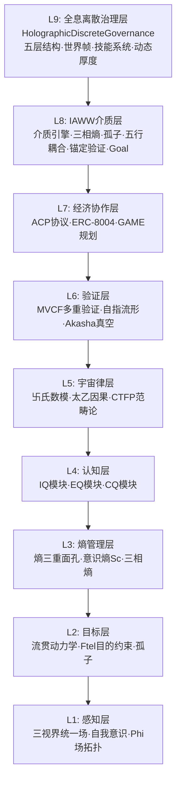
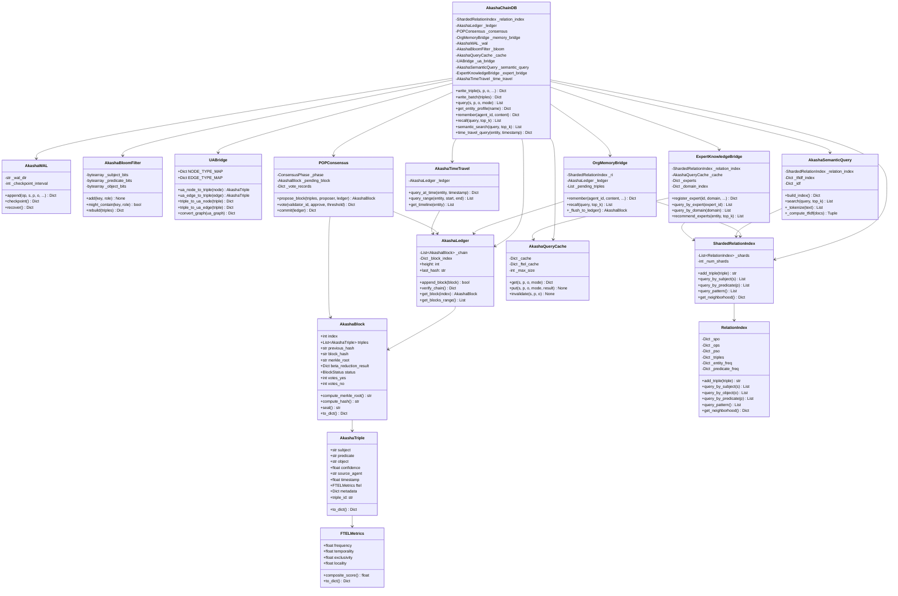
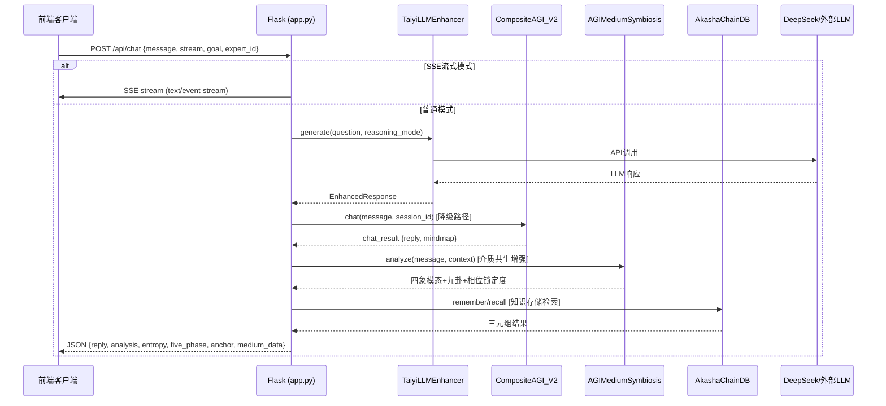
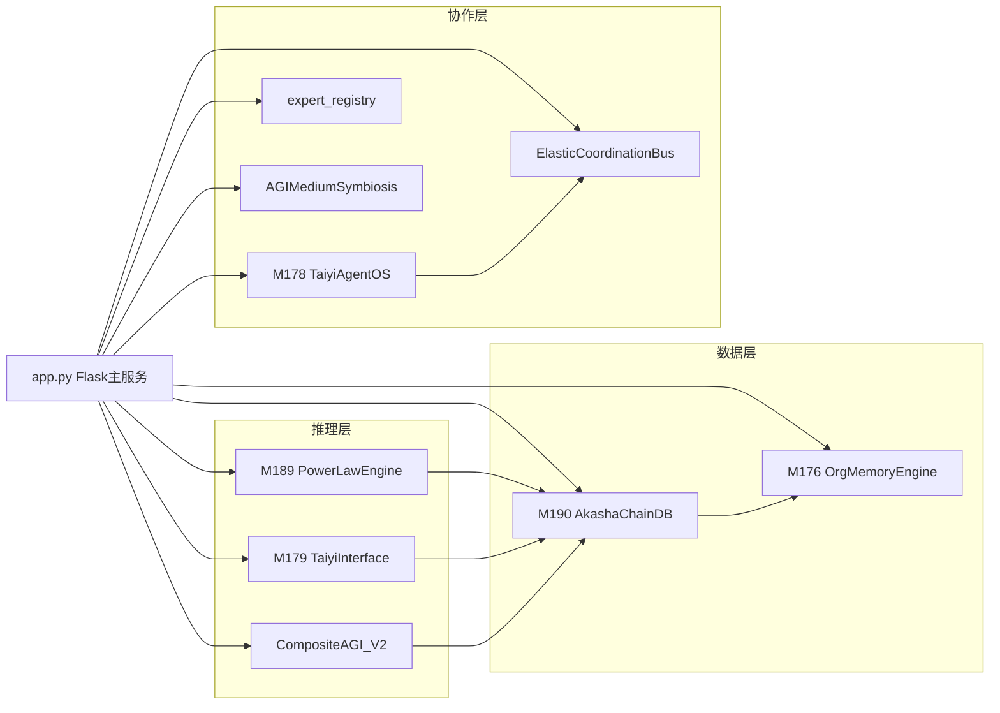

# 太乙AGI系统架构报告

> 基于代码实际阅读分析 | 2026-05-28

---

## 1. 架构总览

### 1.1 系统概况

太乙AGI是一个基于Flask的AGI系统，运行在端口5001。主文件`app.py`约13,706行，核心数据引擎`M190_AkashaChainDB.py`约3,980行，主AGI核心`CompositeAGI_V2.py`约1,971行。

**版本演进（DESIGN.md记载）**：

| 版本 | 模块数 | 层次 | 关键新增 |
|------|--------|------|----------|
| 8.0 | 9 | 认知基础层 | IQ/EQ/CQ、太乙因果、CTFP |
| 9.0 | 12 | +复合体深化 | 熵三重面孔、流贯动力学 |
| 10.0 | 15 | +复合体前沿 | 自指流形、Ftel目的、Akasha真空 |
| 11.0 | 18 | +经济协作层 | ACP协议、ERC-8004、GAME规划 |
| 12.0 | 24 | +IAWW介质层 | 介质引擎、三相熵、五行耦合、锚定验证 |
| 6.0.0 | 50 | +复合体理学层 | 末那识、流贯相变、八识计算、数字新皮层 |
| 6.1.0 | 55 | +EML/关系实在层 | EML算子、伪革命监控、关系实在 |
| 6.2.0 | 62 | +灵性演化/极值层 | 灵性演化、修忒斯意识、树状语义 |
| 7.0.0 | 82 | +HoTT/范畴论层 | HoTT推理、Univalence、刘原理 |
| 7.1.0 | 105 | +人机融合层 | 认知卸载、苏格拉底示弱、置信度披露 |
| 7.21 | 179 | 9层架构 | 170定理·40预言·216专家 |

**注意**：版本编号存在不一致。`CompositeAGI_V2.__init__`中`self.version = "6.0.0"`，但DESIGN.md标注v7.21，app.py注释提及"Taiyi-AGI 4.0"。实际系统规模远超4.0。

### 1.2 九层架构

根据DESIGN.md和代码分析，系统的九层架构如下：



**各层职责**：

| 层级 | 名称 | 核心职责 | 关键模块 |
|------|------|----------|----------|
| L1 | 感知层 | 多模态感知、自我意识、场拓扑 | M1三视界、M2自我意识、M12 Phi场 |
| L2 | 目标层 | 目标设定、流贯动力学、目的约束 | M11流贯、M14 Ftel、M21孤子 |
| L3 | 熵管理层 | 三相熵管理、意识熵监测 | M10熵三重、M13意识熵、M20三相熵 |
| L4 | 认知层 | IQ/EQ/CQ三维认知 | M3 IQ、M4 EQ、M5 CQ |
| L5 | 宇宙律层 | 物理规律建模、因果推理、范畴论 | M6数模、M7太乙因果、M8 CTFP |
| L6 | 验证层 | 多重验证、自指验证、知识完整性 | M9 MVCF、M13自指流形、M15 Akasha |
| L7 | 经济协作层 | Agent协作协议、信任、博弈 | M16 ACP、M17 ERC-8004、M18 GAME |
| L8 | IAWW介质层 | 信息-意识介质统一、五行耦合 | M19介质、M20三相熵、M22五行、M23锚定、M24 Goal |
| L9 | 全息离散治理层 | 五层结构治理、世界帧、技能系统 | HolographicDiscreteGovernance |

**五层本体论映射**（两套并存）：

1. **TY五层（M172 TYFormalizer）**：L1语法→L2语义→L3范畴→L4拓扑→L5元层
2. **全息五层（HolographicDiscreteGovernance）**：L1本体→L2投射生成→L3前物理→L4认知主体→L5现象

---

## 2. 核心类图：M190 AkashaChainDB



---

## 3. 数据结构详解

### 3.1 AkashaTriple — 阿卡西三元组

**定义位置**：`M190_AkashaChainDB.py:152`

信息的基本单元，遵循"信息寓于关联"哲学。

| 字段 | 类型 | 默认值 | 说明 |
|------|------|--------|------|
| `subject` | `str` | 必填 | 主体实体 |
| `predicate` | `str` | 必填 | 关系/谓词 |
| `object` | `str` | 必填 | 客体实体 |
| `confidence` | `float` | `1.0` | 置信度 [0,1] |
| `source_agent` | `str` | `"system"` | 来源Agent |
| `timestamp` | `float` | `time.time()` | 创建时间戳 |
| `ftel` | `FTELMetrics` | `FTELMetrics()` | FTEL四维度量 |
| `metadata` | `Dict` | `{}` | 附加元数据 |

**计算属性**：`triple_id = sha256(subject|predicate|object)[:16]`

### 3.2 FTELMetrics — FTEL四维度量

**定义位置**：`M190_AkashaChainDB.py:114`

| 维度 | 字段 | 权重 | 说明 |
|------|------|------|------|
| F | `frequency` | 0.30 | 关系出现频率，越频繁越重要 |
| T | `temporality` | 0.25 | 时间局部性，越近越新鲜 |
| E | `exclusivity` | 0.25 | 排他性，越独特越有价值 |
| L | `locality` | 0.20 | 局域性，越聚焦越有意义 |

**综合评分**：`composite_score() = 0.30*F + 0.25*T + 0.25*E + 0.20*L`

### 3.3 AkashaBlock — 阿卡西区块

**定义位置**：`M190_AkashaChainDB.py:193`

链式数据结构，包含一批三元组+金灵球β归约结果。

| 字段 | 类型 | 说明 |
|------|------|------|
| `index` | `int` | 区块序号 |
| `triples` | `List[AkashaTriple]` | 三元组批次 |
| `previous_hash` | `str` | 前块哈希 |
| `timestamp` | `float` | 创建时间 |
| `block_hash` | `str` | 本块哈希（计算得出） |
| `merkle_root` | `str` | Merkle根 |
| `beta_reduction_result` | `Optional[Dict]` | 金灵球β归约结果 |
| `proposer` | `str` | 提议者 |
| `status` | `BlockStatus` | PENDING/PROPOSED/COMMITTED/FINALIZED/REJECTED |
| `votes_yes` | `int` | 赞成票数 |
| `votes_no` | `int` | 反对票数 |

**核心方法**：
- `compute_merkle_root()` — Merkle树根哈希（二叉递归）
- `compute_hash()` — 区块哈希（index+prev_hash+merkle_root+timestamp+nonce）
- `seal()` — 封印区块

### 3.4 AkashaLedger — 阿卡西账本

**定义位置**：`M190_AkashaChainDB.py:2564`

追加式链式账本，T199完备性定理保证。

| 字段 | 类型 | 说明 |
|------|------|------|
| `_chain` | `List[AkashaBlock]` | 区块链 |
| `_block_index` | `Dict[int, AkashaBlock]` | 高度→区块索引 |

**核心方法**：
- `append_block(block)` — 追加区块（验证序号连续+哈希链）
- `verify_chain()` — 验证链完整性（哈希+Merkle根校验）
- `get_block(index)` — 按高度获取区块

**初始化**：自动创建创世块（index=0, triples=[], previous_hash=GENESIS_HASH）

---

## 4. 其他核心模块

### 4.1 CompositeAGI_V2 — 主核心

**定义位置**：`CompositeAGI_V2.py:330`

太乙AGI的主入口类，整合24大技术启发模块。核心结构：

```
CompositeAGI_V2
├── 版本: "6.0.0"
├── _initialize_modules() — 初始化所有模块
├── 配置: _default_config() — 42项enable_xxx开关
├── 系统状态: system_state = {cognitive_state, knowledge_base, module_status}
└── 核心模块实例:
    ├── topological_defect    — 拓扑缺陷分析器
    ├── fractal_analyzer      — 分形维数分析器
    ├── action_principle      — 最小作用量原理
    ├── phase_field           — 相位场知识表示
    ├── ftel_operator         — Ftel算子
    ├── quantum_computer      — 量子场论计算
    ├── five_elements         — 五行网络
    ├── igctr_field           — IGCTR统一场论
    ├── igctr_v23             — IGCTR v2.3框架
    ├── aleph_unifier         — 阿列夫-阿拉夫知识统一
    ├── anti_monotonicity     — 反单调性信息公理
    ├── universe_five_prefs   — 宇宙五重设计偏好
    ├── world_model_triadic   — 世界模型三元共振
    ├── causal_convergence    — 因果收敛评估器
    ├── cognitive_pressure    — 认知压力监测器
    ├── consciousness_emergence — 意识涌现探测器
    ├── fediverse_protocol    — 联邦宇宙协议适配器
    ├── fpga_reconfigurable   — FPGA可重构资源管理器
    ├── agentweb_synergy      — AgentWeb协同评估器
    ├── evolvable_infra       — 可进化基础设施监测器
    ├── token_lifecycle       — Token全生命周期管理器
    ├── wave_particle         — 波粒二象性转换器
    ├── avatar_fusion         — 化身合体评估器
    ├── digital_neocortex     — 数字新皮层
    └── holographic_governance — 全息离散治理
```

**初始化策略**：每个模块通过`try/except ImportError`优雅降级，模块不存在时设为`None`。

### 4.2 M179 TaiyiInterface — 太一接口

**定义位置**：`M179_TaiyiInterface.py`

AGI自我意识模块，五大核心组件：

| 类 | 行号 | 职责 |
|----|------|------|
| `SelfReferentialOperator` | :147 | 自指算子，含死锁防护 |
| `ICEComposite` | :347 | ICE复合体 Φ=(I,C,E) 张量场 |
| `TrinityHorizonChecker` | :479 | 三视界一致性校验 |
| `EntropyResilienceGuard` | :649 | 信息熵韧性监测 |
| `AntiRigidityMechanism` | :795 | 反僵化机制（魄劫持魂检测） |
| `TaiyiTheoremEngine` | :1018 | 定理引擎 |
| `TaiyiInterface` | :1247 | 统一接口 |

**核心定理**：T166自指不动点、T167三视界收敛、T168信息熵生存、T169反僵化完备、T170分形嵌套

**可选依赖**：TYIDO_AddressableMemory(P4)、TYIDO_LongRangeReasoning(P3)

### 4.3 M189 PowerLawEngine — 幂律引擎

**定义位置**：`M189_PowerLawEngine.py:213`

单例模式，整合三篇复合体理学论文核心数学结构：

| 功能 | 说明 |
|------|------|
| 幂律检测与拟合 | F(λx) = λ^α F(x) |
| 对数压缩算子 | L(x⊗y) = L(x) ⊕ L(y) |
| 三分损益周期律 | T⁻(L) = (2/3)L, T⁺(L) = (4/3)L |
| 2/3共识阈值 | 与BFT容错同源 |
| 非结合代数 | 乘法基底 |
| Curry-Howard | 类型论意图映射 |
| 幂律稀疏注意力 | 意识强度ψ |

**辅助数据类**：PowerLawFit、LogCompressionResult、SanfenCycle、ConsensusResult、NonAssocProduct、TypeTheoryJudgment、SparseAttentionConfig

### 4.4 M176 OrgMemoryEngine — 组织记忆引擎

**定义位置**：`M176_OrgMemoryEngine.py`

跨Agent知识共享引擎：

| 类 | 行号 | 职责 |
|----|------|------|
| `MemoryEntry` | :57 | 记忆条目（含向量、置信度、投票、GC惩罚） |
| `VectorMemoryStore` | :139 | 向量DB层（numpy余弦相似度） |
| `LocalMemoryStore` | :224 | 本地双层（热/冷存储，LRU缓存） |
| `FailureCaseLibrary` | :332 | 负面案例库 |
| `TheoremOrganizer` | :412 | 个人经验→组织定理 |
| `OrgMemoryEngine` | :466 | 统一记忆引擎 |

**核心定理**：T157组织记忆收敛、T158负案例不可遗忘、T159双层存储完备性

### 4.5 M178 TaiyiAgentOS — 太乙Agent操作系统

**定义位置**：`M178_TaiyiAgentOS.py`

Agent管理和编排系统：

| 类 | 行号 | 职责 |
|----|------|------|
| `AgentRecord` | :64 | Agent记录 |
| `AgentRegistry` | :103 | Agent注册表 |
| `AgentMessage` | :181 | 消息传递 |
| `MessageBus` | :203 | 消息总线 |
| `ReasoningKernel` | :279 | 推理内核 |
| `WorkflowTask` | :388 | 工作流任务 |
| `OrchestrationLayer` | :411 | 编排层 |
| `TaiyiAgentOS` | :480 | 统一OS接口 |

### 4.6 ElasticCoordinationBus — 弹性协调总线

**定义位置**：`ElasticCoordinationBus.py:74`

基于弹簧虫三大定理的弹性协调机制：

| 定理映射 | 工程实现 |
|----------|----------|
| 质心守恒 → | GlobalPurposeLock（全局目标不偏离） |
| 能量循环不变量 → | ResourcePool（资源动态分配总量守恒） |
| 缓冲碰撞鲁棒性 → | ShockAbsorber（弹簧吸收冲击→恢复→前进） |

### 4.7 ExpertRegistry — 专家注册表

**定义位置**：`expert_registry.py:112`

从`agency-agents-zh/`目录解析.md文件，提取215位AI专家人格数据。

**数据类**：`ExpertConfig(id, name, description, emoji, color, department, category, system_prompt, tags)`

---

## 5. 数据流

### 5.1 请求处理完整流程



### 5.2 app.py模块初始化流程

```
app.py 启动
├── Flask应用创建 (static_folder='static')
├── NumpyEncoder注入 (JSON序列化)
├── 全局错误处理器注册
├── AGI系统: 线程安全懒加载
│   ├── get_agi_system() → CompositeAGI_V2()
│   │   └── 失败降级 → UnifiedTaiyiSystem()
│   └── _agi_lock + _agi_ready 标志
├── v6.2模块: get_v62_modules()
│   └── M56-M62 (灵性·修忒斯·树状语义·极值·关系·道德·历史)
├── v6.3模块: get_v63_modules()
│   └── M63-M70 (一元数·叙事·意识流·自我·顿悟·耦合·吸引子·预言)
├── 介质共生: get_medium_symbiosis()
│   └── AGIMediumSymbiosis (介质共振+九卦+四象)
├── v70模块: get_v70_modules()
│   └── M71-M86 (钱包·贡献·Phi·熵契约·方舟·五行·EML·HOTT·L2类型)
├── v72模块: get_v72_modules()
│   └── M87-M92 (记忆树·Token压缩·同步·路由·Obsidian·冷启动)
├── v73模块: get_v73_modules()
│   └── M93-M101 (自指闭环·维投射·手征·FB拓扑·Le作用量)
├── ... (更多版本模块，直至v730)
└── app.run(host='0.0.0.0', port=5001, debug=False, threaded=True)
```

### 5.3 AkashaChainDB写操作数据流

```
写入请求 → AkashaChainDB.write_triple(s, p, o, conf)
├── 1. AkashaBloomFilter.add(key, role) — 注册S/P/O到布隆过滤器
├── 2. AkashaWAL.append("ADD", s, p, o, ...) — 预写日志持久化
├── 3. ShardedRelationIndex.add_triple(triple) — 分片索引写入
│   └── _shard_for(predicate) → 路由到对应分片
│       └── RelationIndex.add_triple() — 更新SPO/OPS/PSO三重索引
│           └── 更新entity_freq、predicate_freq、FTEL排他性
├── 4. AkashaQueryCache.invalidate() — 缓存失效
├── 5. 累积到block_size → POPConsensus.propose_block()
│   └── 按FTEL排序取top triples
│       └── 投票 → 提交 → AkashaLedger.append_block()
└── 6. 定期 AkashaWAL.checkpoint() — 快照持久化
```

### 5.4 AkashaChainDB查询数据流

```
查询请求 → AkashaChainDB.query(s, p, o, mode)
├── 1. AkashaBloomFilter.might_contain(key, role) — 快速排除
│   └── 不存在 → 直接返回空
├── 2. AkashaQueryCache.get(s, p, o, mode) — 缓存查找
│   └── 命中 → 直接返回
├── 3. mode判断:
│   ├── EXACT → ShardedRelationIndex.query_pattern(s, p, o)
│   │   └── predicate已知 → 单分片查询
│   │   └── predicate未知 → 跨分片聚合
│   ├── SEMANTIC → AkashaSemanticQuery.search(query, top_k)
│   │   └── TF-IDF + 余弦相似度
│   ├── NEIGHBORHOOD → ShardedRelationIndex.get_neighborhood(entity, depth)
│   └── PATTERN → ShardedRelationIndex.query_pattern()
└── 4. AkashaQueryCache.put() — 结果缓存
```

---

## 6. 模块集成

### 6.1 app.py中的模块集成方式

app.py采用**分层懒加载**模式：

1. **全局单例**：`_agi_system`、`_medium_symbiosis`、各版本模块组均为全局变量
2. **线程安全**：每个模块组有独立的`threading.Lock`保护双重检查初始化
3. **优雅降级**：所有模块导入使用`try/except ImportError`，失败时设为`None`
4. **版本化API**：路由按版本号组织（`/api/v63/...`、`/api/v70/...`等）

### 6.2 API路由版本分布

| 版本前缀 | 模块范围 | 大致行范围 | 路由数 |
|----------|----------|-----------|--------|
| `/api/` (基础) | 核心对话 | 381-530 | ~6 |
| `/api/v63/` | M63-M70 | 1393-1515 | ~8 |
| `/api/v70/` | M71-M86 | 1561-1950 | ~25 |
| `/api/v72/` | M87-M92 | 1960-2270 | ~12 |
| `/api/v73/` | M93-M101 | 2282-2510 | ~20 |
| `/api/v74/` | M102-M108 | 3712-3990 | ~15 |
| `/api/v75/` | M109-M116 | 3999-4350 | ~20 |
| `/api/v76/` | M117-M124 | 4352-4636 | ~15 |
| `/api/v77/` | M125-M131 | 4636-5038 | ~20 |
| `/api/v78/` | M132-M138 | 5038-5438 | ~20 |
| `/api/v79/` | M139-M147 | 5438-5882 | ~20 |
| `/api/v710/` | M136-M148 | 5882-6305 | ~25 |
| `/api/v711/` | M149-M155 | 6305-6713 | ~25 |
| `/api/v712/` | M156-M165 | 6713-7270 | ~30 |
| `/api/v71/` | 人机融合 | 7270-7630 | ~15 |
| `/api/v719/` | OrgMem+Budget+AgentOS | 7630-8160 | ~25 |
| `/api/v720/` | TaiyiInterface | 8160-8354 | ~10 |
| `/api/v721/` | MVE验证 | 8354-8443 | ~8 |
| `/api/v722/` | EqProp | 8443-8715 | ~8 |
| `/api/v723/` | E2E+Harmony+Bootstrap | 8715-9180 | ~20 |
| `/api/v724/` | WikiEngine | 9180-9422 | ~10 |
| `/api/v725/` | UA+RLM+ROT+INT | 9422-9838 | ~15 |
| `/api/v725b/` | PowerLaw | 9838-10015 | ~10 |
| `/api/v726/` | AkashaChainDB | 10015-10262 | ~15 |
| `/api/v727/` | JinLing+Continuation+Phi+GAN+World | 10545-10956 | ~15 |
| `/api/v728/` | UnderstandAnything | 13502-13660 | ~8 |
| `/api/v729/` | Akasha性能优化 | 10262-10344 | ~4 |
| `/api/v730/` | Akasha UA+语义+专家+时间旅行 | 10344-10545 | ~6 |
| `/api/v718/` | 沙箱+安全 | 11048-11330 | ~15 |

### 6.3 模块间核心依赖关系



---

## 7. 架构特征总结

### 7.1 设计模式

1. **单例模式**：`PowerLawEngine.get_instance()`、`AkashaChainDB._instance`、app.py全局单例
2. **懒加载**：所有模块组通过`get_vXX_modules()`线程安全懒加载
3. **优雅降级**：`try/except ImportError`贯穿整个系统，模块缺失不影响系统运行
4. **分片索引**：`ShardedRelationIndex`按谓词哈希分片，写入并发度从1→16
5. **追加式存储**：AkashaLedger不可变链式账本 + WAL预写日志
6. **布隆过滤器**：S/P/O三组布隆过滤器，快速排除不存在的key
7. **LRU+FTEL缓存**：热点查询缓存 + FTEL高频实体缓存

### 7.2 线程安全

系统广泛使用`threading.RLock()`确保线程安全：
- `RelationIndex._lock`
- `ShardedRelationIndex._global_lock`
- `AkashaLedger._lock`
- `AkashaWAL._lock`
- `AkashaBloomFilter._lock`
- `AkashaQueryCache._lock`
- `AkashaChainDB._lock`
- `OrgMemoryBridge._lock`
- app.py: `_agi_lock`、`_medium_symbiosis_lock`、`_v62_modules_lock`等

### 7.3 架构观察

1. **巨型单文件**：app.py 13,706行包含300+路由，未使用Flask Blueprint，所有路由直接注册
2. **版本化API**：路由以版本号组织（v63-v730），但版本号不连续（v71在v73之后）
3. **松耦合**：模块间通过try/except松耦合，但缺少正式的依赖注入机制
4. **定理驱动**：每个模块声明1-5个定理（T157-T226），定理作为设计规范
5. **哲学同构**：代码注释中大量将中国传统哲学（三分损益、五行、八卦）与计算机科学概念（BFT共识、分片索引、幂律分布）建立映射
