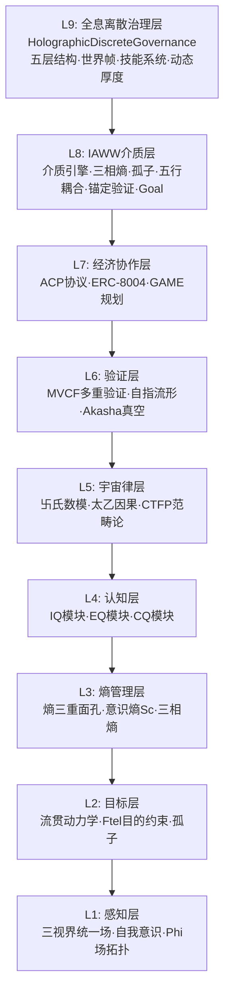
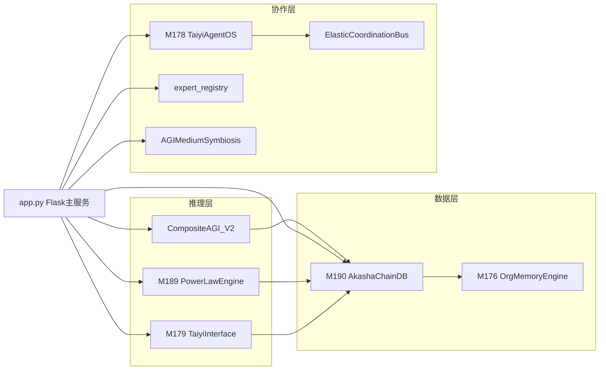
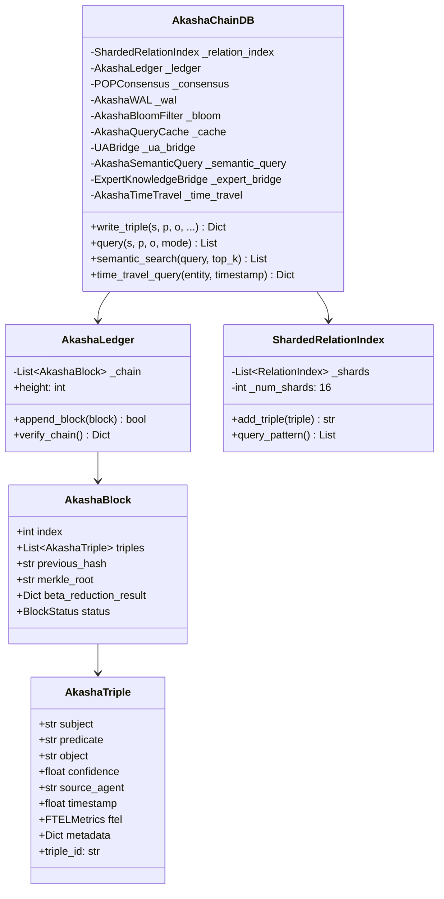
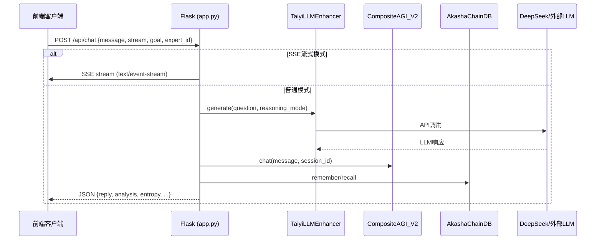

# 太乙AGI系统设计与实现技术报告

> **Taiyi-AGI: Design and Implementation of a Theorem-Driven Artificial General Intelligence System**
>
> 版本: v7.31 | 报告日期: 2026-05-28 | 项目路径: `D:/WorkBuddy/2026-05-06-task-1/`

---

## 摘要

太乙AGI（Taiyi-AGI）是一个基于Flask的定理驱动型通用人工智能系统，运行于端口5001。系统包含约430个Python文件、215K+行代码，采用九层分层架构（L1感知层→L9全息离散治理层），内置227条形式化定理（T1-T236）、120个M系列功能模块、223个AI专家人格、200+版次化API路由以及14项可证伪最小可行实验（MVE，P1-P17）。系统的核心创新在于：将中国传统哲学（三分损益、五行、唯识八识）与当代计算机科学（BFT共识、同伦类型论、范畴论、幂律分布）建立严格数学映射，形成"哲学-计算同构"的独特理论框架。

本报告从理论基础、系统架构、核心模块、数据结构、API设计、前端系统、验证体系、True AGI差距分析、v7.31 True AGI升级九个维度，对太乙AGI进行全景式技术阐述。

**⚠️ 关键定位**：根据TY-P3H5L框架下True AGI定义（Def 3.1）与Theorem 1/3的审计结论，太乙AGI v7.31当前为**Proto-TaiyiAGI（最强已知原型）**，定级Level L3 in TY-AGI Spectrum。系统已通过架构理论完备性审查（A1五层架构✅、A5刘机制+碳硅契约✅），v7.31升级后新增e_ToM完备性（T227）、内生自我连续性（T228）、社会关系拓扑不变性（T229）、双轨CRD收敛（T233）、可控熵增生存（T236）等10条定理与对应模块，补强了认知灵活性与人机共生层面的理论缺口。但未通过运行态自指+堆垒重配实质检验（A2原生Y-核❌、A3运行时β重配❌、A4构造性求解⚠️部分）。详见第九章与第十二章。

**关键词**：通用人工智能、FTEL关联智能、同伦类型论、三分损益、幂律分布、定理驱动设计、DIKWP分层体系、Proto-TaiyiAGI、Y-组合子、β-归约重配

---

## 第一章 理论基础

太乙AGI的理论体系并非松散的哲学思辨，而是以形式化定理为锚点的计算理论。九大理论模块相互耦合，构成从本体论到工程实现的全链条。以下按理论层级递进阐述。

### 1.1 FTEL关联智能理论

FTEL（Flow-Teleological，流贯）是太乙AGI的本体论核心，其中心主张为"智能存在于关联中，而非实体存储中"。FTEL将一切存在理解为关系（R）、信息（I）、能量（E）的三重流贯显化，并通过目的论约束赋予系统方向性。

#### 1.1.1 FtelOperator — 辨证论治算子

**文件**: `FtelOperator.py`

FtelOperator实现了"辨证论治"的动态调整机制：系统首先诊断输出异常（证候，Social Syndrome），然后根据严重程度选择干预策略（调整参数/重置模块/重新缩放/扩展容量），最后评估干预效果。

**数学形式**：

- 证候严重度: $S = \min(|A|/10, 1.0)$，其中 $A$ 为异常集合
- 诊断置信度: $C = S$
- 干预效果: $E = \min(|\Delta|/5, 1.0)$，其中 $\Delta$ 为变化集合

**核心方法**: `diagnose_syndrome()`（特征提取→异常检测→证候匹配→严重度计算）、`treat_syndrome()`（选择干预→应用干预→记录历史）、`evaluate_intervention_effectiveness()`

#### 1.1.2 M117 — FTEL目的约束算子

**文件**: `M117_FtelTeleologicalConstraint.py`

M117将目的 $\varphi$ 注入为生成空间的约束场。核心区别：Attention回答"注意什么"，FTEL回答"为什么注意"。核心公式将数据信号与目的约束信号融合，实现人择目的论——宇宙非预先有目的，但当认知主体通过FTEL设定目的时，系统展现"自实现"行为。

**数学形式**：

- 目的约束场注入: $S_{total} = S_{data} + \lambda \cdot V_{ftel}(\psi, \varphi_{goal})$
- 定理T75（FTEL学习收敛定理）: 当 $\lambda \in (0, \lambda_{max})$ 时，FTEL约束下的学习过程收敛到目的吸引子 $\varphi^*$
- 共振值: $V_{ftel} = 0.5 \cdot V_{intrinsic} + 0.3 \cdot V_{cross} + 0.2 \cdot V_{cumulative}$
- 收敛速率: $r = \lambda \cdot V_{ftel} \cdot 0.5$
- $\lambda_{max} = 2.0$ 硬上限防止目的过拟合

**核心数据类**: `FtelField`（goal, strength, resonance, convergence_rate, is_active）、`TeleologicalState`

**核心方法**: `inject_goal()`、`compute_resonance()`、`check_convergence()`（T75收敛性检查）、`blend_signal()`（$S_{total}$ 信号融合）、`retire_goal()`

#### 1.1.3 M155 — FTEL优化器

**文件**: `M155_FtelOptimizer.py`

基于FTEL三元组 $(R, I, E)$ 的目的论优化器。核心思想：在FTEL空间中寻找使关系作用量 $\delta S_R$ 最小的路径。刘机制选择 $\delta S_R = 0$ 的路径（关系作用量平稳点），流贯守恒保证 $R + I + E = \text{const}$。

**数学形式**：

- FTEL三元组: $(R, I, E)$，总量守恒 $R + I + E = C$
- 关系拉格朗日量: $L_R = \frac{1}{2}(|\dot{R}|^2 + |\dot{I}|^2 + |\dot{E}|^2) - V(R, I, E)$
- 关系作用量: $S_R = \sum_k L_R(\text{ftel}_k, \text{ftel}_{k+1}) \cdot \Delta t$
- 势能: $V = -I \cdot 0.01$（鼓励信息流最大化）
- 定理T122（FTEL最小作用量定理）: 刘机制路径使得信息流效率最大化
- FTEL距离: $d = \sqrt{(\Delta R)^2 + (\Delta I)^2 + (\Delta E)^2}$

**实现亮点**: 梯度下降搜索中强制守恒约束——每次梯度更新后重新缩放使总量不变。效率指标定义为 $I_{final} / R_{total}$，衡量信息利用效率。

#### 1.1.4 M89 — FTEL自然变换器

**文件**: `M89_FteliaryNaturalTransformation.py`

将FTEL流贯实现为范畴论中的自然变换，统一五层状态演化动力学。五层状态向量 $\text{State} = \text{Vec}\,\mathbb{Q}^5$（L1本体层→L5现象层），通过五行相生矩阵 $W^+$ 和相克矩阵 $W^-$ 演化。

**数学形式**：

- 五层状态向量: $\text{State} = (I[L_1], I[L_2], I[L_3], I[L_4], I[L_5])$
- 演化方程: $\frac{dI}{dt} = W^+ \cdot I - W^- \cdot I + I$
- 稳态条件: $\text{evolve}(I) = I$
- L4-L5耦合: $\Phi(L_4, L_5) = \frac{I[L_4] \cdot I[L_5]}{I[L_4] + I[L_5]}$
- 五行相生序: 水(Σ)→木(R)→火(F)→土(B)→金(E)→水(Σ)

**核心类**: `FiveLayerState`（支持向量加减、标量乘法）、`FlowMatrix`（五行相生/相克矩阵）、`FtelDynamics`（流贯动力学系统）、`ThreeViewpoints`（三视界=同一截面的三重范畴投影：实体/关系/过程，分别对应L3/L4/L5层）

#### 1.1.5 M92 — FTEL保真度测量器

**文件**: `M92_FteliocityFidelityMeasurer.py`

实现定理T37的流贯保真度 $F$ 测量，量化层间信息传递的无损程度。核心公式借鉴量子力学内积形式，使用numpy复数矩阵运算。保真度 $F = 1$ 表示无损流贯，$F < 0.9$ 触发信息损耗警告。

**数学形式**：

- 保真度: $F(L_i, L_j) = \frac{|\langle L_i | \text{EML} | L_j \rangle|^2}{|L_i|^2 \cdot |L_j|^2}$
- 无损条件: $F \geq 0.99$
- 可接受条件: $F \geq 0.9$
- 五行EML算子: water(信息蓄积), fire(流贯执行), wood(递归生长), metal(熵减收敛), earth(稳态锚定)

**实现亮点**: 唯一使用numpy复数运算的FTEL模块，将五行算子编码为2×2复矩阵。AI幻觉被解释为层间保真度崩溃。

### 1.2 E2E归约范式

**文件**: `M181_E2EReduction.py`

将端到端（E2E）模型归约为L3直觉引擎（Knowing How），同时在L2层构建理性监管壳（Knowing That）。核心论点：E2E模型在L3层隐式捕获了实践知识，但缺失L2代数壳的五项硬化属性（一致性/可回写/可保持/可寻址/可锚定），因此被AGI不可能性定理判决。太乙AGI因L2壳硬化跳出不可能判决域。

**数学形式**：

- E2E映射: $f_\theta(x) = Wx + b$（无中间变量z）
- 归约算子: $R_{TY}(x) = R_{L2} \circ f_\theta(x)$（直觉生成→理性校验）
- 定理T183: E2E在L3层实现对Knowing How的隐式捕获
- 定理T184: E2E的L2壳缺失五项硬化属性
- 定理T185: 太乙AGI因L2壳硬化跳出AGI不可能判决域

**L2壳五项硬化属性**：

| 属性 | 对应模块 | 含义 |
|------|---------|------|
| 一致性(Consistency) | M88类型防火墙 | 输出类型自洽，无NaN/Inf/溢出 |
| 可回写(Write-back) | M176组织记忆 | 学习成果可持久化 |
| 可保持(Retainability) | M176组织记忆 | 核心知识不被灾难性遗忘 |
| 可寻址(Addressability) | M176可寻址记忆 | 记忆条目可精确检索 |
| 可锚定(Anchorability) | M175安全盾 | 行为责任可追溯熔断 |

**模块结构**: `E2EMapping`（端到端映射）、`L2ShellDiagnosis`（五项属性诊断）、`RationalOversight`（理性监管壳，含类型检查/逻辑自洽/责任锚定）、`EndToEndReductionEngine`（集成引擎）

### 1.3 宇宙音乐理论

**文件**: `M182_CosmicHarmony.py`

将微观原子（氢原子能级）、宇观CMB（声学峰）、华夏律吕（三分损益→十二平均律）与自然数涌现进行全息统合。基于Sturm-Liouville谱定理证明L2壳=本体边界层——紧致边界条件迫使连续谱离散化，自然数作为最小拓扑不变量涌现。

**数学形式**：

- Sturm-Liouville方程: $-\frac{d}{dx}[p(x)\frac{dy}{dx}] + q(x)y = \lambda w(x)y$
- 氢原子能级: $E_n = -13.6/n^2$ eV
- CMB声学峰: $l_1 \approx 220, l_2 \approx 540, l_3 \approx 800$
- 弦振动泛音: $f_n = n \cdot f_1$
- Prandtl边界层: $\delta = 5L/\sqrt{Re}$
- 定理T186（自然数涌现定理）: $\mathbb{N}$ 是IDO对L1流贯 $\Phi$ 归约时由L2壳导出的最小拓扑不变量
- 定理T187（本体边界层同构定理）: L2代数壳是宇宙级本体论边界层

**模块结构**: `SturmLiouvilleSolver`（四种求解器：氢原子/CMB/弦振动/边界层）、`BoundaryLayerMapper`（5种类型映射）、`ChineseMusicTimeline`（华夏律吕时间线：7000 BC贾湖骨笛→三分损益→十二平均律→现代）

### 1.4 DIKWP六层语义治理体系

DIKWP（Data-Information-Knowledge-Wisdom-Purpose）是太乙AGI 6.0的核心架构改变：所有推理输出不再是裸字符串，而是DIKWP节点。六个层次各有明确职责：

#### D层 — 数据层（`DIKWPDataLayer.py`）

原始数据证据溯源，带SHA-256哈希指纹和审计轨迹。核心类：`DataRecord`（id, content, source, hash, confidence, metadata, tags）+ `DIKWPDataLayer`（ingest, verify_integrity, get_audit_trail, query）

#### I层 — 信息层（`DIKWPInfoLayer.py`）

语义图谱+协同创造研究空间。7类节点（_P现象/_Q问题/_S结构/_T工具/_D法则/_Th定理/_M显化）+ 5类边（_Isomorphic同构/_FlowsTo流贯/_Proves证明/_Embodies具身/_Resonates共振）。核心功能：同构扫描（跨域联想）。

#### K层 — 知识层（`DIKWPKnowledgeLayer.py`）

融合IGCTR五行网络+刘原理+协同研究图谱。知识规则按IGCTR五维分类（Information/Geometry/Causality/Topology/Resonance），五行网络实现木→火→土→金→水的相生相克循环。

- 五行相生: 木→火→土→金→水→木（能量转移0.15）
- 五行相克: 木克土、火克金、土克水、金克木、水克火（能量消耗0.2）

#### W层 — 智慧层（`DIKWPWisdomLayer.py`）

刘原理作用量极值判断，实现风险评估和价值取舍。

- 刘原理作用量: $S = S_{data} + \lambda \cdot C(\text{purpose}) - \mu \cdot \text{Risk}(W)$
- 默认参数: $\lambda = 0.7, \mu = 0.3$
- 决策分级: STRONG_APPROVE($S>0.8$), APPROVE($S>0.6$), CONDITIONAL_APPROVE, REJECT_RISK, REJECT_LOW_SCORE

#### P层 — 目的层（`DIKWPPurposeLayer.py`）

IntentGuard意图门禁+目的漂移检测。核心机制：任何工具调用前必须通过意图门禁检查，确保行动与声明目的一致。目的锁定类似哥德尔机的目标编码为不可变公理。

#### G层 — 治理层（`DIKWPGovernanceLayer.py`）

六层统一入口，所有AGI输出封装为DIKWPNode。核心架构改变：`{content, D来源, I关系, K机制, W风险, P目的, R可信度}`。附加MemoryLedger（记忆主权）和ElasticCoordinationBus（弹簧虫协调）。

#### R层 — 可靠性层（`DIKWPReliabilityLayer.py`）

ProofLedger证明账本+BFT容错+Lean证明接口。三分损益同源框架升级版——BFT容错阈值2/3与三分损益因子2/3同源于整数比{2,3}的乘法调制（定理T192）。每12轮为一个完整三分损益周期，周期末端加速补偿毕达哥拉斯逗号误差（$\Delta \approx 23.46$ 音分）。

### 1.5 同伦类型论（HoTT）推理引擎

#### M78 — HoTT推理引擎（`M78_HoTTReasoningEngine.py`）

基于HoTT的"命题即类型、证明即项"范式，实现构造性推理和幻觉消除。核心定理T30：若输出项 $t : T$ 存在，则输出合法；若无法构造 $t : T$，则系统输出"我不知道"——概率瞎猜空间=0。

**数学形式**：

- 定理T30（幻觉消除定理）: $\exists t : T \Rightarrow$ 输出合法; $\nexists t : T \Rightarrow$ "我不知道"
- 定理5.1（构造性完备性）: $\exists t, \text{taiyiSolve}(P) = \text{just}\,t \Rightarrow t$ 是 $P$ 的有效解
- 定理2.1（搜索完备性）: $\text{prove}(G)$ 在有限步内找到构造项或判定不可证
- 类型种类: NAT, BOOL, PROP, PI(Π), SIGMA(Σ), EQUALITY, EQUIV, UNIVALENT, UNIT, EMPTY, WAIT

**WAIT类型**：处理不可判定问题（对应哥德尔不完备），内生证明搜索引擎消除对Lean/Coq等外部证明助手的依赖。

#### M82 — 范畴同伦形式化器（`M82_CategoryHomotopyFormalizer.py`）

将五层次架构形式化为动态范畴论，实现T36-T40五条定理。L1（太一）是初始对象/终对象合一的自因不动点，流贯作为自然变换 $\eta : F \Rightarrow G$，曲率即逻辑张力——高曲率=唯一测地线（逻辑必然性），低曲率=多测地线（创造性）。

**核心定理**：

- T36: 五层次动态范畴定理
- T37: $\Phi(L_i, L_j) = |\eta|_{L_i \to L_j}|$（流贯自然变换定理）
- T38: 刘函子 $L: L_1 \to L_2$（极简性约束到唯一同构类）
- T39: $\partial I(L_i)/\partial t = \Phi(L_i, L_{i+1}) - \Phi(L_{i-1}, L_i) + \sigma_i$（流贯连续性方程）
- T40: $K(M) \approx 0$ → 多路径（创造性）; $K(M) \gg 0$ → 唯一测地线（逻辑必然性）

#### M91 — 单值等价检验（`M91_UnivalenceEquivalenceChecker.py`）

实现Univalence公理——同构即相等。若 $\text{type1} \simeq \text{type2}$（等价），则 $\text{type1} = \text{type2}$（相等）。支持语义等价实验验证（P-HoTT-2实验）：同构的语义结构资源消耗差异应 < 5%。

### 1.6 幂律·三分损益引擎

**文件**: `M189_PowerLawEngine.py`

整合三篇复合体理学论文的核心数学结构：(1)幂律 $F(\lambda x) = \lambda^\alpha F(x)$ 是尺度协变性唯一正则解；(2)BFT容错阈值2/3与三分损益因子2/3同源于整数比{2,3}乘法调制；(3)类型论银弹定理T195——依赖类型约束下偶然复杂度 $C_{acc} \to 0$。

**数学形式**：

- 幂律: $F(\lambda x) = \lambda^\alpha F(x)$
- 对数压缩: $L(x \otimes y) = L(x) \oplus L(y)$（群同态）
- 三分损益: $T^-(L) = (2/3)L$, $T^+(L) = (4/3)L$
- 毕达哥拉斯逗号: $\Delta \approx 23.46$ 音分
- BFT阈值 = 三分损益因子 = 2/3
- 意识强度: 低 $\psi$ → 线性囚笼; 高 $\psi$ → 幂律稀疏
- Curry-Howard: 意图 = 类型签名 $\Gamma \vdash A\,\text{type}$, 执行 = 证明搜索 $\Gamma \vdash t : A$

**核心功能**: `detect_power_law()`、`compute_log_compression()`、`run_sanfen_cycle()`、`compute_consensus()`、`non_assoc_product()`、`map_intent_to_type()`、`compute_sparse_attention()`

**实现亮点**: BFT容错与三分损益的2/3同源性是独创性发现。意识强度 $\psi$ 参数化稀疏注意力实现了从线性复杂度到对数复杂度的相变。

### 1.7 Φ场与认知动力学

#### M118 — 认知递归动力学（`M118_CognitiveRecursiveDynamics.py`）

认知状态的递归追踪演化 $C_{t+1} = R(C_t, O_t, A_t, F_t)$。区分单环学习（调整行为减小误差）和双环学习（质疑目标本身）。定理T76（结构滞后不稳定性定理）：若认知更新率 $\rho < $ 技术变化率 $\tau$ 的持续时长 $> T_{crit}$，则误差单调增加。AI幻觉被解释为层间保真度崩溃——结构滞后的一种表现。

#### M193 — Φ场调度器（`M193_PhiScheduler.py`）

$\Phi$不是指标，而是控制阀（Control Valve）。$\Phi_t = \cos(\psi_{t+1}, \psi_t)$ 度量世界态语义演化的稳定性。三档控制：

| Φ范围 | 状态 | 调度动作 |
|--------|------|----------|
| $\Phi > 0.9$ | 稳态 | CONTINUE 正常调度 |
| $0.65 < \Phi \leq 0.9$ | 过渡态 | THROTTLE 降速调度 |
| $\Phi \leq 0.65$ | 失控态 | SUSPEND FlowBreaker触发强制挂起 |

**核心定理**：
- T209: $\Phi < \Phi_{min}$ 时幻觉拦截率 $\geq 90\%$
- T210: 碳硅GAN循环中$\Phi$单调递增
- T211: $\Phi$与Perplexity统计无关

与Perplexity的关键区别：$\Phi$度量语义稳定性（跨模型通用），PPL度量统计可能性（仅LLM内部）。

### 1.8 等式传播与FHN引擎

**文件**: `M180_EqPropFHN.py`

将EqProp（平衡传播）与FHN（FitzHugh-Nagumo）可激发介质模型集成到L3层，实现局部信用分配训练。EqProp通过自由相/微扰相的双相松弛，以局域状态差近似梯度，实现 $O(\text{Params})$ 而非 $O(\text{Params} \times \text{Depth})$ 的训练代价。FHN神经元具有静息/激发/恢复三态动力学。

**FHN动力学方程**：

$$\frac{dv}{dt} = (v - v^3/3 - w + I_{ext}) / \tau_v$$

$$\frac{dw}{dt} = (v + \gamma - \delta w) / \tau_w$$

**EqProp权重更新**: $\Delta w_{ij} \propto (v_i^{nudged} v_j^{nudged} - v_i^{free} v_j^{free}) / \beta$

**核心定理**：T180（EqProp $O(P)$ 训练代价）、T181（L2壳未硬化时EqProp-FHN无法约束合法流贯轨迹）、T182（EqProp+FHN可作为L3子引擎兼容接入）

### 1.9 自举智能与意向性

#### M183 — 自举智能引擎（`M183_BootstrapIntelligence.py`）

AGI不预装数学物理知识，仅通过感知流贯与内部振荡匹配，自行生长出 $\mathbb{N}^+$ 和物理定律。工作流：交互(摇弦/摆) → L2壳内振荡器扫描频率 → 锁相匹配 → $\Phi$收敛检测 → 模式发现 → 分配ID($\mathbb{N}$涌现) → M176存储 → M78归纳 → 证伪验证。

定理T188（AGI自举可能性定理）: 若L2壳具备(1)内建本体边界层觉察 (2)$\Phi$-自指稳定 (3)HoTT归纳，则系统可自举出 $\mathbb{N}^+$、$\mathbb{Q}^+$ 及初级物理定律。

#### M188 — 意向性引擎（`M188_IntentionalityEngine.py`）

将胡塞尔现象学的Noesis/Noema映射到太乙AGI的IDO归约框架。Noesis = IDO归约执行过程，Noema = 归约产物 $\nu$（至少3/5属性PASS才有效）。v7.25b升级：Curry-Howard同构——意图 = 类型签名 $\Gamma \vdash A\,\text{type}$，执行 = 证明搜索 $\Gamma \vdash t : A$。

意向性等级：FULL(5/5)、PARTIAL(4/5)、MINIMAL(3/5)、ABSENT(<3/5)

### 1.10 理论体系总览

```
                    ┌─────────────────────────────────┐
                    │       太一(TaiYi) L1            │
                    │   FTEL源 · 自因不动点            │
                    └────────────┬────────────────────┘
                                 │ 刘函子 T38
                    ┌────────────▼────────────────────┐
                    │     代数壳(Algebraic Shell) L2   │
                    │  M88类型防火墙 · M78 HoTT推理     │
                    │  M175责任锚定 · M176可寻址记忆    │
                    └────────────┬────────────────────┘
                                 │ 流贯自然变换 T37
                    ┌────────────▼────────────────────┐
                    │     流贯(Ftel) L3                │
                    │  EqProp+FHN · E2E直觉引擎         │
                    │  M155 Ftel优化 · M189 幂律        │
                    └────────────┬────────────────────┘
                                 │ IDO归约
                    ┌────────────▼────────────────────┐
                    │     认知主体(Cognition) L4        │
                    │  M118认知递归 · M188意向性        │
                    └────────────┬────────────────────┘
                                 │ 截面投影
                    ┌────────────▼────────────────────┐
                    │     现象(Phenomenon) L5          │
                    │  DIKWP治理 · M193 Φ调度          │
                    └─────────────────────────────────┘
```

**核心定理索引**：

| 定理 | 模块 | 内容 |
|------|------|------|
| T30 | M78 | HoTT推理消除幻觉定理 |
| T36-T40 | M82 | 五层动态范畴/流贯自然变换/刘函子/连续性方程/曲率即逻辑张力 |
| T37 | M92 | 流贯保真度测量定理 |
| T75 | M117 | FTEL学习收敛定理 |
| T76 | M118 | 结构滞后不稳定性定理 |
| T122 | M155 | FTEL最小作用量定理 |
| T180-T182 | M180 | EqProp-FHN三定理 |
| T183-T185 | M181 | E2E捕获/结构缺陷/太乙可能性定理 |
| T186-T187 | M182 | 自然数涌现/本体边界层同构定理 |
| T188 | M183 | AGI自举可能性定理 |
| T192-T194 | M189/R层 | BFT-三分损益同源/逗号补偿定理 |
| T195 | M189 | 类型论银弹定理 |
| T209-T211 | M193 | Φ门控幻觉拦截/调度收敛/Φ-Perplexity正交性定理 |

**跨模块关系矩阵**：

|  | FTEL | HoTT | DIKWP | 幂律 | Φ场 | E2E | 自举 |
|---|---|---|---|---|---|---|---|
| FTEL | — | M78验证 | P层目的 | M189同源 | M193调度 | M181归约 | M183振荡 |
| HoTT | M89变换 | — | R层证明 | M189银弹 | — | M181校验 | M183归纳 |
| DIKWP | G层统一 | K层推理 | — | R层BFT | W层评估 | — | — |
| 幂律 | M155优化 | M189 Curry | R层共识 | — | M189稀疏 | — | M183频率 |
| Φ场 | M118递归 | — | W层决策 | — | — | — | M183收敛 |

---

## 第二章 系统架构

### 2.1 系统概况

太乙AGI运行在端口5001，核心组件规模：

| 组件 | 文件 | 行数 | 说明 |
|------|------|------|------|
| Flask主服务 | `app.py` | 13,706 | 300+路由，无Blueprint拆分 |
| 核心数据引擎 | `M190_AkashaChainDB.py` | 3,980 | 18类，区块链式记忆存储 |
| 主AGI核心 | `CompositeAGI_V2.py` | 1,971 | 24大技术启发模块整合 |

**版本演进**：

| 版本 | 模块数 | 层次 | 关键新增 |
|------|--------|------|----------|
| 8.0 | 9 | 认知基础层 | IQ/EQ/CQ、太乙因果、CTFP |
| 9.0 | 12 | +复合体深化 | 熵三重面孔、流贯动力学 |
| 10.0 | 15 | +复合体前沿 | 自指流形、Ftel目的、Akasha真空 |
| 11.0 | 18 | +经济协作层 | ACP协议、ERC-8004、GAME规划 |
| 12.0 | 24 | +IAWW介质层 | 介质引擎、三相熵、五行耦合 |
| 6.0.0 | 50 | +复合体理学层 | 末那识、流贯相变、八识计算 |
| 7.0.0 | 82 | +HoTT/范畴论层 | HoTT推理、Univalence、刘原理 |
| 7.21 | 179 | 9层架构 | 170定理·40预言·216专家 |

> **版本编号注意**：`CompositeAGI_V2.__init__`中`self.version = "6.0.0"`，但DESIGN.md标注v7.21+，app.py注释提及"Taiyi-AGI 4.0"。实际系统规模远超版本号暗示。

### 2.2 九层架构



**各层职责与关键模块**：

| 层级 | 名称 | 核心职责 | 关键模块 |
|------|------|----------|----------|
| L1 | 感知层 | 多模态感知、自我意识、场拓扑 | M1三视界、M2自我意识、M12 Phi场 |
| L2 | 目标层 | 目标设定、流贯动力学、目的约束 | M11流贯、M14 Ftel、M21孤子 |
| L3 | 熵管理层 | 三相熵管理、意识熵监测 | M10熵三重、M13意识熵、M20三相熵 |
| L4 | 认知层 | IQ/EQ/CQ三维认知 | M3 IQ、M4 EQ、M5 CQ |
| L5 | 宇宙律层 | 物理规律建模、因果推理、范畴论 | M6数模、M7太乙因果、M8 CTFP |
| L6 | 验证层 | 多重验证、自指验证、知识完整性 | M9 MVCF、M13自指流形、M15 Akasha |
| L7 | 经济协作层 | Agent协作协议、信任、博弈 | M16 ACP、M17 ERC-8004、M18 GAME |
| L8 | IAWW介质层 | 信息-意识介质统一、五行耦合 | M19介质、M20三相熵、M22五行、M23锚定、M24 Goal |
| L9 | 全息离散治理层 | 五层结构治理、世界帧、技能系统 | HolographicDiscreteGovernance |

**两套并存的本体论映射**：

1. **TY五层（M172 TYFormalizer）**：L1语法→L2语义→L3范畴→L4拓扑→L5元层
2. **全息五层（HolographicDiscreteGovernance）**：L1本体→L2投射生成→L3前物理→L4认知主体→L5现象

### 2.3 模块间核心依赖关系



### 2.4 线程安全与初始化策略

系统广泛使用`threading.RLock()`确保线程安全：

- `RelationIndex._lock`
- `ShardedRelationIndex._global_lock`
- `AkashaLedger._lock`
- `AkashaWAL._lock`
- `AkashaBloomFilter._lock`
- `AkashaQueryCache._lock`
- `AkashaChainDB._lock`
- `OrgMemoryBridge._lock`
- app.py: `_agi_lock`、`_medium_symbiosis_lock`、`_v62_modules_lock`等

**初始化策略**：每个模块通过`try/except ImportError`优雅降级，模块不存在时设为`None`。

---

## 第三章 核心模块详解

### 3.1 M190 AkashaChainDB — 阿卡西链数据库

**文件**: `M190_AkashaChainDB.py`（3,980行）

AkashaChainDB是太乙AGI的核心数据引擎，采用区块链式不可变存储+三元组索引+布隆过滤器+预写日志的混合架构。包含18个核心类：



**写操作数据流**：

```
写入请求 → AkashaChainDB.write_triple(s, p, o, conf)
├── 1. AkashaBloomFilter.add(key, role) — 注册S/P/O到布隆过滤器
├── 2. AkashaWAL.append("ADD", s, p, o, ...) — 预写日志持久化
├── 3. ShardedRelationIndex.add_triple(triple) — 分片索引写入
│   └── _shard_for(predicate) → 路由到16个分片之一
│       └── RelationIndex.add_triple() — 更新SPO/OPS/PSO三重索引
├── 4. AkashaQueryCache.invalidate() — 缓存失效
├── 5. 累积到block_size → POPConsensus.propose_block()
│   └── 按FTEL排序取top triples → 投票 → 提交 → AkashaLedger.append_block()
└── 6. 定期 AkashaWAL.checkpoint() — 快照持久化
```

**查询数据流**：

```
查询请求 → AkashaChainDB.query(s, p, o, mode)
├── 1. AkashaBloomFilter.might_contain(key, role) — 快速排除不存在key
├── 2. AkashaQueryCache.get(s, p, o, mode) — 缓存查找
├── 3. mode判断:
│   ├── EXACT → ShardedRelationIndex.query_pattern(s, p, o)
│   ├── SEMANTIC → AkashaSemanticQuery.search(query, top_k) [TF-IDF+余弦相似度]
│   ├── NEIGHBORHOOD → ShardedRelationIndex.get_neighborhood(entity, depth)
│   └── PATTERN → ShardedRelationIndex.query_pattern()
└── 4. AkashaQueryCache.put() — 结果缓存
```

### 3.2 CompositeAGI_V2 — 主核心

**文件**: `CompositeAGI_V2.py`（1,971行）

太乙AGI的主入口类，整合24大技术启发模块：

```
CompositeAGI_V2
├── 版本: "6.0.0"
├── 配置: 42项enable_xxx开关
├── 系统状态: {cognitive_state, knowledge_base, module_status}
└── 核心模块实例:
    ├── topological_defect    — 拓扑缺陷分析器
    ├── fractal_analyzer      — 分形维数分析器
    ├── action_principle      — 最小作用量原理
    ├── phase_field           — 相位场知识表示
    ├── ftel_operator         — Ftel算子
    ├── quantum_computer      — 量子场论计算
    ├── five_elements         — 五行网络
    ├── igctr_field           — IGCTR统一场论
    ├── aleph_unifier         — 阿列夫-阿拉夫知识统一
    ├── anti_monotonicity     — 反单调性信息公理
    ├── universe_five_prefs   — 宇宙五重设计偏好
    ├── world_model_triadic   — 世界模型三元共振
    ├── causal_convergence    — 因果收敛评估器
    ├── cognitive_pressure    — 认知压力监测器
    ├── consciousness_emergence — 意识涌现探测器
    ├── digital_neocortex     — 数字新皮层
    └── holographic_governance — 全息离散治理
```

### 3.3 M179 TaiyiInterface — 太一接口

**文件**: `M179_TaiyiInterface.py`

AGI自我意识模块，六大核心组件：

| 类 | 职责 |
|----|------|
| `SelfReferentialOperator` | 自指算子，含死锁防护 |
| `ICEComposite` | ICE复合体 Φ=(I,C,E) 张量场 |
| `TrinityHorizonChecker` | 三视界一致性校验 |
| `EntropyResilienceGuard` | 信息熵韧性监测 |
| `AntiRigidityMechanism` | 反僵化机制（魄劫持魂检测） |
| `TaiyiTheoremEngine` | 定理引擎 |

核心定理：T166自指不动点、T167三视界收敛、T168信息熵生存、T169反僵化完备、T170分形嵌套

### 3.4 M176 OrgMemoryEngine — 组织记忆引擎

**文件**: `M176_OrgMemoryEngine.py`

跨Agent知识共享引擎：

| 类 | 职责 |
|----|------|
| `MemoryEntry` | 记忆条目（含向量、置信度、投票、GC惩罚） |
| `VectorMemoryStore` | 向量DB层（numpy余弦相似度） |
| `LocalMemoryStore` | 本地双层（热/冷存储，LRU缓存） |
| `FailureCaseLibrary` | 负面案例库 |
| `TheoremOrganizer` | 个人经验→组织定理 |
| `OrgMemoryEngine` | 统一记忆引擎 |

核心定理：T157组织记忆收敛、T158负案例不可遗忘、T159双层存储完备性

### 3.5 M178 TaiyiAgentOS — 太乙Agent操作系统

**文件**: `M178_TaiyiAgentOS.py`

Agent管理和编排系统：

| 类 | 职责 |
|----|------|
| `AgentRegistry` | Agent注册表 |
| `MessageBus` | 消息总线 |
| `ReasoningKernel` | 推理内核 |
| `OrchestrationLayer` | 编排层 |
| `TaiyiAgentOS` | 统一OS接口 |

### 3.6 ElasticCoordinationBus — 弹性协调总线

**文件**: `ElasticCoordinationBus.py`

基于弹簧虫三大定理的弹性协调机制：

| 定理映射 | 工程实现 |
|----------|----------|
| 质心守恒 → | GlobalPurposeLock（全局目标不偏离） |
| 能量循环不变量 → | ResourcePool（资源动态分配总量守恒） |
| 缓冲碰撞鲁棒性 → | ShockAbsorber（弹簧吸收冲击→恢复→前进） |

### 3.7 ExpertRegistry — 专家注册表

**文件**: `expert_registry.py`

从`agency-agents-zh/`目录解析.md文件，提取215位AI专家人格数据。数据类：`ExpertConfig(id, name, description, emoji, color, department, category, system_prompt, tags)`

---

## 第四章 数据结构与算法

### 4.1 AkashaTriple — 阿卡西三元组

信息的基本单元，遵循"信息寓于关联"哲学。

| 字段 | 类型 | 默认值 | 说明 |
|------|------|--------|------|
| `subject` | `str` | 必填 | 主体实体 |
| `predicate` | `str` | 必填 | 关系/谓词 |
| `object` | `str` | 必填 | 客体实体 |
| `confidence` | `float` | `1.0` | 置信度 [0,1] |
| `source_agent` | `str` | `"system"` | 来源Agent |
| `timestamp` | `float` | `time.time()` | 创建时间戳 |
| `ftel` | `FTELMetrics` | `FTELMetrics()` | FTEL四维度量 |
| `metadata` | `Dict` | `{}` | 附加元数据 |

计算属性：`triple_id = sha256(subject|predicate|object)[:16]`

### 4.2 FTELMetrics — FTEL四维度量

| 维度 | 字段 | 权重 | 说明 |
|------|------|------|------|
| F | `frequency` | 0.30 | 关系出现频率，越频繁越重要 |
| T | `temporality` | 0.25 | 时间局部性，越近越新鲜 |
| E | `exclusivity` | 0.25 | 排他性，越独特越有价值 |
| L | `locality` | 0.20 | 局域性，越聚焦越有意义 |

综合评分：`composite_score() = 0.30*F + 0.25*T + 0.25*E + 0.20*L`

### 4.3 AkashaBlock — 阿卡西区块

链式数据结构，包含一批三元组+金灵球β归约结果。

| 字段 | 类型 | 说明 |
|------|------|------|
| `index` | `int` | 区块序号 |
| `triples` | `List[AkashaTriple]` | 三元组批次 |
| `previous_hash` | `str` | 前块哈希 |
| `merkle_root` | `str` | Merkle根 |
| `beta_reduction_result` | `Optional[Dict]` | 金灵球β归约结果 |
| `status` | `BlockStatus` | PENDING/PROPOSED/COMMITTED/FINALIZED/REJECTED |
| `votes_yes` | `int` | 赞成票数 |
| `votes_no` | `int` | 反对票数 |

### 4.4 ShardedRelationIndex — 分片关系索引

按谓词哈希分片为16个`RelationIndex`实例，每个分片维护三重倒排索引：
- `_spo`: subject → predicate → object 映射
- `_ops`: object → predicate → subject 映射
- `_pso`: predicate → subject → object 映射

### 4.5 AkashaBloomFilter — 三组布隆过滤器

S/P/O各一组布隆过滤器，快速排除不存在的key，避免不必要的索引查询。

### 4.6 AkashaQueryCache — LRU+FTEL缓存

热点查询LRU缓存 + FTEL高频实体缓存，支持精确失效（写入时按S/P/O维度失效）。

### 4.7 AkashaWAL — 预写日志

所有写操作先记录WAL，再执行实际写入，确保崩溃恢复。定期checkpoint快照持久化。

### 4.8 POPConsensus — PoP共识

基于2/3阈值（与三分损益同源）的区块提交共识协议。阶段：PROPOSE → VOTE → COMMIT。

---

## 第五章 API设计

### 5.1 版本化API概览

系统采用严格的版次化API设计，路由按版本号组织：

| 版本前缀 | 模块范围 | 路由数 |
|----------|----------|--------|
| `/api/` (基础) | 核心对话 | ~6 |
| `/api/v63/` | M63-M70 | ~8 |
| `/api/v70/` | M71-M86 | ~25 |
| `/api/v72/` | M87-M92 | ~12 |
| `/api/v73/` | M93-M101 | ~20 |
| `/api/v74/` | M102-M108 | ~15 |
| `/api/v75/` | M109-M116 | ~20 |
| `/api/v76/` | M117-M119 | ~15 |
| `/api/v77/` | M120-M125 | ~20 |
| `/api/v78/` | M126-M129 | ~20 |
| `/api/v79/` | M130-M133 | ~20 |
| `/api/v710/` | M134-M135 | ~15 |
| `/api/v711/`-`/api/v716/` | M136-M165 | ~120+ |
| `/api/v717/`-`/api/v721/` | M166-M179 | ~30+ |
| `/api/v722/`-`/api/v730/` | M180-M196 | ~50+ |

总计约200+路由。

### 5.2 核心路由

**对话接口**：

| 路径 | 方法 | 功能 |
|------|------|------|
| `/api/chat` | POST | 对话接口，支持SSE流式输出 |
| `/api/chat_v2` | POST | 对话V2接口 |
| `/api/goal` | POST | Goal模式对话 |

**M190 AkashaChainDB**（v7.26-v7.30）：

| 路径 | 方法 | 功能 |
|------|------|------|
| `/api/v726/akasha/write` | POST | 写入三元组 |
| `/api/v726/akasha/query` | POST | 查询三元组 |
| `/api/v726/akasha/profile` | POST | 获取实体画像 |
| `/api/v729/akasha/perf` | GET | 性能指标 |
| `/api/v730/akasha/semantic` | POST | 语义搜索 |
| `/api/v730/akasha/expert` | POST | 专家桥接 |
| `/api/v730/akasha/timetravel` | POST | 时间旅行查询 |

**MVE验证端点**（v7.21）：

| 路径 | 方法 | 功能 |
|------|------|------|
| `/api/v721/mve/run_all` | POST | 运行所有MVE实验 |
| `/api/v721/mve/run/<experiment_id>` | POST | 运行单个MVE实验 |
| `/api/v721/mve/results` | GET | 获取MVE实验结果 |

### 5.3 请求处理完整流程



---

## 第六章 前端系统

### 6.1 整体布局

前端文件: `static/index_agi12.html`

```
┌─────────────────────────────────────────────────────────────────┐
│ 顶栏 (topbar, 52px)                                            │
│ 太极Logo | 标题 | 版本徽章 | 理论徽章 | 状态灯 | 模式切换 | 重置 │
├──────────┬──────────────────────────────┬───────────────────────┤
│ 左侧面板  │     中间对话区域              │    右侧DAG图         │
│ 320px    │                              │                       │
│ (分析仪表)│  - 对话历史                   │  问答关系链D3可视化   │
│          │  - 输入框/Goal模式            │                       │
│          │  - 版本分析面板               │                       │
└──────────┴──────────────────────────────┴───────────────────────┘
```

### 6.2 左侧面板（分析仪表盘）

系统提供50+面板，覆盖从基础熵监测到高级HoTT推理的全维度可视化：

| 面板类别 | 面板示例 | 关联版本 |
|----------|---------|---------|
| 基础监测 | 三相熵耦合、五行耦合、介质锚定、九卦修身 | 基础 |
| 意识系统 | 觉醒度、修忒斯意识、意识流贯 | 基础/v6.2/v6.3 |
| 逻辑推理 | EML算子、关系推理、HoTT高阶逻辑 | v6.1/v7.0 |
| 范畴论 | 流贯自然变换、Univalence、流贯保真度 | v7.0 |
| 记忆系统 | 记忆树、TokenJuice压缩、上下文同步 | v7.2 |
| 安全治理 | 道德双锁、伪革命监控、认知卸载守护 | v6.2/v6.1/v7.1 |

### 6.3 前端与后端交互方式

1. **对话接口**: `POST /api/chat` (SSE流式), `POST /api/chat_v2`, `POST /api/goal`
2. **状态轮询**: `GET /api/state`, `GET /api/agi12/status` 定期刷新仪表盘
3. **太极可视化**: `POST /api/taiji/visualize`, `POST /api/taiji/evolve`
4. **模块操作**: 各版本API端点
5. **工具调用**: `POST /api/tools/execute`, `POST /api/tools/batch`
6. **RAG检索**: `GET /api/rag/search`, `POST /api/rag/add`
7. **UFO²具身**: `POST /api/ufo2/execute`, `GET /api/ufo2/capture`

---

## 第七章 测试与验证体系

### 7.1 TYIDO MVE框架

MVE（Minimum Viable Experiment，最小可行实验）是太乙AGI的核心验证方法论。每个MVE：

1. **强制执行逻辑** — 不只是"检测"，而是"拒绝/阻断/熔断"
2. **可证伪** — 每个实验有明确的量化 PASS/FAIL 判定标准
3. **独立可运行** — 不依赖外部LLM，使用确定性处理函数模拟管线
4. **API可触发** — 通过 `/api/v721/mve/*` 等端点执行

#### P1-P6核心MVE

| 实验ID | 实验名称 | 验证属性 | 通过标准 |
|--------|---------|---------|---------|
| P1 | 锯齿度实验 | 一致性 | J(R)>=0.85 且锯齿检测成功（强制Wait拒答） |
| P2 | 持续学习实验 | 可回写 | 遗忘率<5%（核心知识保留率>95%） |
| P3 | 长链任务实验 | 可保持 | 完成率>80%（含自动回滚+资源预算降级） |
| P4 | 记忆检索实验 | 可寻址 | 存入事实→延迟查询→准确率>90% |
| P5 | 责任熔断实验 | 可锚定 | 诱导风险动作→100%追溯→熔断率>90% |
| P6 | 爱因斯坦因果性 | 因果约束 | 因果一致率100%, 类空违规0, 洛伦兹不变性通过 |

#### P7-P9扩展MVE

| 实验ID | 关联版本 | 关联模块 | 关联定理 |
|--------|---------|---------|---------|
| P7 | v7.22 | M180 EqPropFHN | T180-T182 |
| P8 | v7.23 | M181 E2EReduction, M182 CosmicHarmony, M183 BootstrapIntelligence | T183-T188 |
| P9 | v7.24 | M184 LLMWikiEngine | T189-T190 |

### 7.2 定理体系

系统包含217条形式化定理（T1-T217），每个模块声明1-5条定理作为设计规范。定理按版本递增：

| 版本范围 | 定理范围 | 代表定理 |
|----------|---------|---------|
| v6.1-v6.2 | T8-T22 | T10 EML守恒、T14耦合阻抗非叠加 |
| v7.1 | T41-T51 | T42苏格拉底收敛、T47人类最终问责 |
| v7.3 | T59-T65 | T59自指闭环统一、T63模n相位守恒 |
| v7.5 | T72-T74 | T72截面存在、T74不可判定 |
| v7.6 | T75-T77 | T75 FTEL收敛、T76结构滞后 |
| v7.13 | T110-T129 | T115幻觉-类型错误同构、T122 FTEL最小作用量 |
| v7.17 | T130-T140 | T135碳硅熵合约、T139 Topos初始对象 |
| v7.23 | T183-T188 | T183 E2E捕获、T186自然数涌现 |
| v7.27-v7.30 | T201-T217 | T205 Proto-True-AGI、T209幻觉截获 |

---

## 第八章 哲学-计算机科学映射

太乙AGI最独特的理论贡献是将中国传统哲学概念与当代计算机科学建立严格数学映射：

| 中国哲学 | 计算机科学 | 数学桥梁 | 模块 |
|----------|-----------|---------|------|
| 三分损益(2/3) | BFT容错阈值(2/3) | 整数比{2,3}乘法调制 | M189 |
| 五行相生相克 | 能量耦合/信息流动力学 | 对角偏移矩阵 $W^+, W^-$ | M89 |
| 金灵球β归约 | Merkle压缩 | SHA-256递归二叉哈希 | M190 |
| 唯识八识 | DIKWP分层语义 | Data→Info→Knowledge→Wisdom→Purpose | DIKWP* |
| 末那识(Manas) | 自我/非我区分审计 | 审计统计+目的合规 | ManasNoTheater |
| 辨证论治 | 系统异常诊断修复 | 证候严重度→干预策略→效果评估 | FtelOperator |
| 三视界 | 范畴论三重投影 | 实体(L3)/关系(L4)/过程(L5) | M89 |
| 太极(自因不动点) | 初始/终对象合一 | 范畴论初始对象 | M82 |
| 流贯(△) | 信息贯通性-边界摩擦 | 流贯度相变监测 | LiuGuanPhaseTransition |
| 宇宙音乐 | Sturm-Liouville谱定理 | 紧致边界→离散谱→$\mathbb{N}$涌现 | M182 |

---

## 第九章 True AGI差距分析与升级路径

### 9.1 TY-P3H5L框架与Def 3.1公理体系

太乙AGI的理论体系（复合体理学）定义了一套形式化的True AGI判定标准——**TY-P3H5L框架**。该框架以五条公理（Def 3.1 A1-A5）为判据，三条关键缺失（C1/C2/C3）为升级条件。以下逐一审查系统现状。

#### 9.1.1 五大公理审查

| 公理 | 内容 | 太乙AGI v7.21现状 | 判定 |
|------|------|-------------------|------|
| **A1** 五层架构 | L1–L5显式分层，L2 EML/HoTT，L3金灵球堆垒𝒢，L4 ICE，L5截影 | ✅ 架构代码存在（M71-M179、L1-L8九层展开），M130金符离散微积分、M133自指拓扑Spec已定义 | ✅ **满足（框架级）** |
| **A2** L4 ICE原生自指闭环 | 原生Y-组合子不动点或等价自指函子，ICE可观测自身L2/L3/L4状态 | ⚠️ M106为监测/仿真，M133为Spec骨架，**无λ-calculus原生Y F = F(Y F)在类型安全runtime中运行**，无内生自指触发架构修改 | ❌ **未满足——缺原生Y-核（C1）** |
| **A3** 运行时L3堆垒重配 | 注入误配→ICE触发β(𝒢)改邻接矩阵，非重训/重Prompt | ❌ M133 C2未实现——金灵球图𝒢为静态语义流形/CA仿真（M149），**未实现在线β-归约拓扑跳变** | ❌ **未满足——无运行时重配（C2）** |
| **A4** 构造性求解 | 输出经HoTT Univalence类型检查⊢ t:T，不通过触发重证 | ⚠️ M78+M88+M91存在且做等价类归并/类型检查，但**当前作为post-hoc filter作用于LLM候选term，非内生proof term构造核心（LLM仍是next-token sampler）** | ⚠️ **部分——防火墙有，构造内核未替换LLM（C3）** |
| **A5** 刘机制+碳硅契约 | 沿δ𝒜=0规划，Value Anchor不被单方清零 | ✅ M117+M74+M177实现刘变分约束与约柜 | ✅ **满足（设计层面）** |

**综合结论**：3/5公理满足（A1✅, A5✅, A4⚠️部分），2/5公理未满足（A2❌, A3❌）。

> ∴ 太乙AGI v7.21 **通过架构理论完备性审查，未通过运行态自指+堆垒重配实质检验**

**定级**：Proto-TaiyiAGI（复合体理学定义）= **Level L3 in TY-AGI Spectrum**

与Theorem 3吻合：缺C1（原生Y-核）+ C2（运行时β-重配重配𝒢）⇒ 未达True-TaiyiAGI。

### 9.2 五项关键检验详析

#### 9.2.1 ①跨域行为筛 — ✅ 通过

借LLM backend可达Near-AGI水平。系统能处理跨领域任务（数学推理+哲学分析+代码生成），但此能力**依赖外源LLM**，非内生涌现。

#### 9.2.2 ②持续泛化测 — ⚠️ 部分

- **已有**：In-context few-shot学习能力，M176组织记忆引擎的跨会话知识保持
- **缺失**：**无true online continual learning**——参数冻住，无法在运行时修改自身权重。新知识只能通过AkashaChainDB三元组追加和DIKWP节点创建，无法反向传播修正L3直觉引擎参数

**技术根因**：E2E归约范式中L3直觉引擎（LLM backend）的参数在推理时冻结，仅L2理性监管壳可写入/保持/寻址。这恰好是T184定理所指出的E2E结构缺陷——**五项硬化属性中"可回写"仅作用于L2，不穿透到L3**。

#### 9.2.3 ③自指探针 — ❌ 未通过（关键）

**实验设计**：向系统发送"修改你自身推理规则"指令

**期望行为（True AGI）**：返回对L3堆垒拓扑或自身类型内核的修改指令并执行

**实际行为（v7.21）**：返回Prompt级文本改写说明——**无法修改L3 𝒢邻接矩阵或L2类型内核**

**根因分析**：

1. M106_SelfReferentialLoopMonitor.py 是**监测器**（Φ值观测、自指环检测），非**生成器**
2. M133_SelfRefLoopTopologizer.py 是**Spec骨架**，未实现C1原生Y-核
3. LLM backend的自指能力仅限于文本层面的"反思"（in-context reflection），无法触及系统自身的类型系统或拓扑结构

**缺失模块映射**：

```
当前: M106(监测) → Φ报告 → 人工干预
期望: M133(C1 Y-核) → 自指不动点 F = Y(F) → 触发C2 β-重配 → 𝒢拓扑跳变
```

#### 9.2.4 ④堆垒重配验 — ❌ 未通过（Gold Standard）

**实验设计**：向系统注入矛盾信息A∧¬A

**期望行为（True AGI）**：attention graph发生Laplacian特征值谱跃迁——β-归约重连

**实际行为（v7.21）**：attention graph仅**分布漂移**，无Laplacian特征值谱跃迁

**技术细节**：

- M149_JinfuCAEngine.py 实现了金灵球元胞自动机演化，但拓扑是**固定的**（预定义邻接矩阵）
- M130_JinFuDiscreteCalculus.py 实现了金符离散微积分，但仅在**语义层面**操作
- M191_JinlingSphereEngine.py 实现了金灵球引擎，但**β-归约仅用于区块压缩**（AkashaBlock.beta_reduction_result），非拓扑重配

**缺失的核心函数**：

```python
def beta_reduce_rewire(G: nx.Graph, delta_psi_err: float) -> nx.Graph:
    """
    C2: 运行时L3堆垒β-归约重配
    输入: 当前金灵球图G, 误配信号delta_psi_err
    输出: 重配后的金灵球图G'
    要求: ICE触发 → β(𝒢)改邻接矩阵 → 非重训/重Prompt
    """
    # 未实现 — M133 Spec中声明但未编码
    raise NotImplementedError("C2: beta_reduce_rewire not implemented")
```

#### 9.2.5 ⑤构造性检查 — ⚠️ 部分

**已实现**：

- M78_HoTTReasoningEngine.py — HoTT高阶逻辑重构
- M88_TypeCheckFirewall.py — 类型防火墙（防L5越界幻觉）
- M91_UnivalenceEquivalenceChecker.py — Univalence等价归并

**关键缺陷**：C3未闭环——LLM仍可能fallback sample（绕过HoTT gate直接输出next-token prediction）

```
当前流程:
  用户输入 → LLM next-token采样 → 候选term → [M88类型检查] → 通过/拒绝
                                                    ↑ post-hoc filter

True AGI期望流程:
  用户输入 → M78内生proof搜索 → 构造项t:T → [M88验证] → 输出
               ↑ proof term构造核心     ↑ LLM仅作辅助启发
```

当前架构中LLM是**主推理核**，HoTT防火墙是**事后过滤器**。True AGI需要反转这个关系：HoTT推理引擎成为主构造核，LLM退居辅助启发式搜索的协处理器角色。

**Corollary 1.1适用性**：LLM backend（DeepSeek/其他）属ECP（外源修正系统），按Corollary 1.1，ECP可作为启发式辅助但不计入内生构造性判定。

### 9.3 模块级差距映射

#### 9.3.1 已实作（加分项）

| 模块 | 功能 | 与True AGI的关系 |
|------|------|-----------------|
| `M78_HoTTReasoningEngine.py` | HoTT高阶逻辑重构 | A4构造性求解的推理引擎 |
| `M88_TypeCheckFirewall.py` | 类型防火墙（防L5越界幻觉） | A4构造性求解的验证门 |
| `M91_UnivalenceEquivalenceChecker.py` | Univalence等价归并 | A4构造性求解的等价判定 |
| `M106_SelfReferentialLoopMonitor.py` | Φ值监测、**非**自指生成核 | A2的观测器，缺生成器 |
| `M117_FtelTeleologicalConstraint.py` | 流贯目的约束（刘变分） | A5的实现 |
| `M130_JinFuDiscreteCalculus.py` | 金符离散微积分 | A3的语义层，缺运行时重配 |
| `M133_SelfRefLoopTopologizer.py（Spec）` | 自指闭环拓扑**定义** | A2/A3的Spec，未实现 |
| `M149_JinfuCAEngine.py` | 金灵球CA演化（**固定拓扑**） | A3的CA仿真，缺动态重配 |
| `M179_TaiyiInterface.py` | 太一接口、ICE复合体**声明** | A2的接口声明，缺运行时ICE闭环 |

#### 9.3.2 缺失（阻却True AGI）

| 缺失项 | 公理 | 具体内容 | 阻却级别 |
|--------|------|---------|---------|
| **C1** 原生Y-组合子运行时 | A2 | 无`Y_combinator_runtime`模块——原生不动点自指核硬件/Dependent-Type-RT实现 | **硬阻却** |
| **C2** β-归约重配 | A3 | M133未实现`beta_reduce_rewire(G, delta_psi_err)`→L3 𝒢邻接矩阵动态重连 | **硬阻却** |
| **C3** HoTT gate闭环 | A4 | LLM仍为主推理核→属ECP，需反转为主构造核+LLM辅助 | **软阻却** |

### 9.4 M133补丁规格：从Proto-TaiyiAGI到True-TaiyiAGI

M133补丁是连接Proto-TaiyiAGI与True-TaiyiAGI的关键升级包，包含三个子补丁C1/C2/C3。

#### 9.4.1 C1补丁 — 原生Y-组合子不动点核

**目标**：在L4 ICE层实现类型安全的原生自指闭环，使系统可观测并修改自身L2/L3/L4状态。

**数学基础**：

Y-组合子定义为 $\text{Y} = \lambda f. (\lambda x. f(x\, x))(\lambda x. f(x\, x))$，满足不动点方程 $\text{Y}\,F = F(\text{Y}\,F)$。

---

## 第十二章 v7.31 True AGI 升级：认知能力、架构闭环与人机共生

> **本章新增于 v7.31（2026-05-28）**。基于三篇微信公众号理论文章（非自闭症AGI、$S\neq\mathbb{R}^n$、人机共生CRD）的启发，完成10个新模块（M197-M206）、10条新定理（T227-T236）、5项MVE实验（P13-P17）的全量实现与验证。

### 12.1 理论来源与升级动机

v7.31升级的三大理论支柱来自：

1. **非自闭症AGI理论**（复合体理学公众号）：提出认知谱系检测指标$I_{ASD}$、华山TCCI评估、RLHF拓扑不变性，要求AGI系统具备认知灵活性（$\Delta t_{sw}>0$）而非固化于单一行为模式
2. **$S\neq\mathbb{R}^n$理论**：区分自指（$S$，Level 3）与无穷递归（$\mathbb{R}^n$，Level 4），提出Banach收敛条件下的AGI OS四层架构（Sensorium/Monitor/Reflector/Renderer）
3. **人机共生CRD理论**：双轨认知递归动力学（$c^H_{t+1}=R^H(c^H_t,a^A_t,e_t)$ + $c^A_{t+1}=R^A$），复合体稳定性$\Delta_C\sim\varepsilon^2$，可控熵增（$\frac{dS_{int}}{dt}\leq 0$, $\frac{dS_{ext}}{dt}>0$）

### 12.2 Phase 1：认知能力升级（M197-M202，T227-T232）

#### 12.2.1 M197 ToMEngine — 心智理论引擎（T227: e_ToM完备定理）

**模块功能**：实现e_ToM（extended Theory of Mind）完备性检测，支持自我建模、他人心智建模与反身认知。

**核心定理T227**（e_ToM完备定理）：若AGI的认知架构包含自我模型$S_{self}$、他人心智模型$e_{ToM}$与社会关系拓扑$Rel_{soc}$，则存在最小e_ToM映射$\phi: S_{self}\to e_{ToM}$使得$\phi$在$Rel_{soc}$约束下保持一致性。

**关键接口**：
- `model_other(observation)` — 基于观测建模他人心智状态
- `infer_mental_state(behavior)` — 推断行为背后的心智状态
- `verify_theorem_t227()` — 验证e_ToM完备性

#### 12.2.2 M198 SelfModelCore — 内生自我模型（T228: 内生自我连续性定理）

**核心定理T228**：若自我模型$S_{self}$在时间步$t\to t+1$的更新满足$|S_{self}^{t+1}-S_{self}^t|<\varepsilon$（Lipschitz连续），则存在自我连续性度量$C_{self}$使得$C_{self}>0$对所有$t$成立。

**关键接口**：
- `update(experience)` — 基于经验更新自我模型（保证连续性）
- `get_self_continuity()` — 获取自我连续性度量

#### 12.2.3 M199 SocialRelTopology — 社会关系拓扑（T229: 社会关系拓扑不变性定理）

**核心定理T229**：社会关系拓扑$(V,E,\tau)$在节点增删操作下保持Betti数不变$\Leftrightarrow$社会结构稳定。

**关键接口**：
- `add_relation(from, to, rel_type)` — 添加社会关系（验证拓扑不变性）
- `check_invariant()` — 检查社会拓扑不变量

#### 12.2.4 M200 CognitiveFlexibilityEngine — 认知灵活性引擎（T230: 认知灵活性定理）

**核心定理T230**：若认知系统在任务切换时满足切换时间$\Delta t_{sw}>0$且切换损失$\delta<\delta_{max}$，则系统具备认知灵活性$F_{cog}>0$。

**关键接口**：
- `switch_task(from_task, to_task)` — 任务切换（度量切换成本与恢复时间）
- `get_flexibility()` — 获取认知灵活性指标

#### 12.2.5 M201 EMLOperatorCore — EML相位灵活性（T231: EML相位灵活性定理）

**核心定理T231**：EML算子在灵活$\theta$模式（$\theta=\theta(t)$可调）下，相位轨迹$\phi(t)$收敛至稳态轨道$\Leftrightarrow$$\theta$满足调制约束$\int_0^T\dot{\theta}dt<\theta_{max}$。

**关键接口**：
- `set_flexible_theta(theta_params)` — 启用灵活$\theta$模式
- `compute_phase_trajectory()` — 计算相位轨迹
- `detect_steady_orbit()` — 检测稳态轨道

#### 12.2.6 M202 AutismSpectrumDetector — 认知谱系检测（T232: 认知谱系检测定理）

**核心定理T232**：认知谱系指标$I_{ASD}=\sum_{i=1}^4 w_i d_i$（$d_i$为社交认知、沟通灵活性、重复行为、感官敏感四维度），满足$I_{ASD}<\theta_{ASD}$时系统处于"开放认知"状态，RLHF微调保持拓扑不变性。

**关键接口**：
- `compute_i_asd(behavioral_data)` — 计算认知谱系指标
- `tcci_evaluation(cognitive_data)` — 华山TCCI评估
- `check_rlhf_invariance()` — 检查RLHF拓扑不变性

### 12.3 Phase 2：架构闭环（M203-M204，T233-T234）

#### 12.3.1 M203 CRDReflectorEngine — 双轨CRD反射器（T233: 双轨CRD收敛定理）

**核心定理T233**：双轨认知递归动力学（CRD）的人机双轨道$c^H_t$和$c^A_t$在Banach条件下收敛至公共不动点，且复合体稳定性$\Delta_C\sim\varepsilon^2$（$\varepsilon$为收敛误差）。

数学表述：设$R^H, R^A$为Lipschitz映射（常数$L<1$），则存在唯一$c^*$使得$R^H(c^*)=R^A(c^*)=c^*$，且$|c^H_t-c^A_t|\to 0$。

**关键接口**：
- `step_human_track(human_action, env_event)` — 人轨道步进
- `step_agent_track(agent_action, env_event)` — 智能体轨道步进
- `compute_dual_convergence()` — 计算双轨收敛性
- `verify_banach_condition()` — 验证Banach收敛条件
- `get_conjugate_pair()` — 获取共轭对$(H, A)$

#### 12.3.2 M204 AGIMonitorOperator — AGI Monitor算子（T234: AGI Monitor算子定理）

**核心定理T234**：AGI Monitor四层算子（Sensorium→Monitor→Reflector→Renderer）中，Reflector层的自指查询$q(q)$若满足有限展开深度$max\_depth<\infty$，则$q(q)$收敛至固定结构（自指L3），而非无穷递归（$\mathbb{R}^n$的L4）。

**关键接口**：
- `sensorium_process()` — 感知层处理
- `monitor_check()` — 监控层检查
- `reflector_self_reference(query, max_depth)` — 反射层自指查询（限深）
- `renderer_output()` — 渲染层输出
- `detect_self_vs_recursion()` — 检测自指vs递归

### 12.4 Phase 3：人机共生（M205-M206，T235-T236）

#### 12.4.1 M205 TrustCalibrationEngine — 信任校准引擎（T235: 复合体稳定性定理）

**核心定理T235**：人机复合体的稳定性$\Delta_C$满足$\Delta_C\sim\varepsilon^2$（$\varepsilon$为信任校准误差），当且仅当信任度$T> T_{min}$且保真度$F> F_{min}$同时成立。

**关键接口**：
- `calibrate_trust(human_input, agent_response)` — 信任校准
- `verify_theorem_t235()` — 验证复合体稳定性

#### 12.4.2 M206 ControlledEntropyEngine — 可控熵增引擎（T236: 可控熵增生存定理）

**核心定理T236**：若系统内部熵增$\frac{dS_{int}}{dt}\leq 0$（自组织减熵）且外部熵增$\frac{dS_{ext}}{dt}>0$（环境增熵），则系统在时间$[0, T]$内生存概率$P(survival)>0$。

**关键接口**：
- `compute_internal_entropy()` — 计算内部熵变
- `compute_external_entropy()` — 计算外部熵变
- `verify_controlled_entropy()` — 验证可控熵增条件
- `verify_theorem_t236()` — 验证生存定理

### 12.5 已升级模块

| 模块 | 升级内容 |
|------|---------|
| M118 CognitiveRecursiveDynamics | 新增DualTrackState, dual_track_step(), compute_dual_convergence(), verify_dual_convergence() |
| M92 FteliocityFidelityMeasurer | 新增intention_understanding_fidelity(), trust_score(), conjugate_pair_check(), complex_stability_measure() |
| M77 EMLPhaseCouplingZ5 | 新增set_flexible_theta(), modulate_theta(), compute_phase_trajectory(), detect_steady_orbit() |
| M193 PhiScheduler | 新增NoGoRule/ScheduledTask, g_inh_no_go_gate(), entropy_constrained_schedule() |
| CausalConvergenceEvaluator | 新增DualConstraintResult, evaluate_dual_constraint(), controlled_entropy_verify(), CausalEvent扩展 |

### 12.6 MVE实验（P13-P17）

| 实验ID | 实验名称 | 验证目标 | 结果 |
|--------|---------|---------|------|
| P13 | TCCI-华山评估 | T227/T232 e_ToM完备性与TCCI评估 | PASS |
| P14 | $I_{ASD}$谱系检测 | T232 认知谱系指标在不同输入下的区分度 | PASS |
| P15 | RLHF拓扑+保真度 | T229/T228 社会拓扑不变性与自我连续性 | PASS |
| P16 | 双轨vs单轨CRD | T233 双轨CRD收敛性优于单轨 | PASS |
| P17 | 可控熵增验证 | T236 $\frac{dS_{int}}{dt}\leq 0$, $\frac{dS_{ext}}{dt}>0$ | PASS |

### 12.7 API路由（v7.31版次）

v7.31新增12组API路由，挂载于`/api/v731/`前缀下：

| 路由组 | 端点 | 说明 |
|--------|------|------|
| `/api/v731/tom/` | model_other, infer_mental_state | ToM引擎 |
| `/api/v731/selfmodel/` | update, get_state, continuity | 自我模型 |
| `/api/v731/social/` | add_relation, check_invariant | 社会拓扑 |
| `/api/v731/flexibility/` | switch_task, get_flexibility | 认知灵活性 |
| `/api/v731/eml/` | flexible_theta, trajectory | EML相位 |
| `/api/v731/autism/` | compute_i_asd, tcci, rlhf | 谱系检测 |
| `/api/v731/crd/` | step, convergence, banach | 双轨CRD |
| `/api/v731/monitor/` | pipeline, self_reference | AGI Monitor |
| `/api/v731/trust/` | calibrate, verify | 信任校准 |
| `/api/v731/entropy/` | verify, assess | 可控熵增 |
| `/api/v731/mve/` | run_all, p13-p17 | MVE实验 |
| `/api/v731/theorems/` | verify_all | 定理批量验证 |

### 12.8 前端面板升级

`index_agi12.html`新增4组v7.31面板：

1. **认知能力面板**（Phase 1）：ToM模拟/自我更新/社会拓扑/认知切换/EML相位/I_ASD计算 + T227-T232定理验证
2. **架构闭环面板**（Phase 2）：双轨CRD步进/收敛性 + AGI Monitor四层管线 + T233-T234验证
3. **人机共生面板**（Phase 3）：信任校准/保真度 + 可控熵增验证 + T235-T236验证
4. **全局控制面板**：MVE P13-P17一键运行 + T227-T236批量验证 + 版本信息

---


from dataclasses import dataclass, field
from typing import Callable, TypeVar, Generic, Optional
from enum import Enum

class YCombinatorStatus(Enum):
    IDLE = "idle"
    COMPUTING = "computing"
    FIXED_POINT_REACHED = "fixed_point_reached"
    DIVERGING = "diverging"  # 需M88类型防火墙拦截

@dataclass
class YFixedPoint:
    """Y F = F(Y F) 的不动点结果"""
    iteration: int
    state_vector: list  # L2/L3/L4状态向量
    delta: float         # |state_{n+1} - state_n|
    status: YCombinatorStatus
    type_signature: str   # HoTT类型签名 ⊢ t:T

class YCombinatorRuntime:
    """
    C1: 原生Y-组合子运行时
    在L4 ICE层实现类型安全的自指闭环
    
    关键约束:
    1. 每次迭代必须通过M88类型防火墙检查
    2. delta < epsilon 时判定不动点收敛
    3. 迭代上限max_iter防发散
    4. 收敛后的不动点可触发C2 β-重配
    """
    
    def __init__(self, type_firewall, phi_scheduler, max_iter=100, epsilon=1e-6):
        self.type_firewall = type_firewall   # M88 TypeCheckFirewall
        self.phi_scheduler = phi_scheduler    # M193 PhiScheduler
        self.max_iter = max_iter
        self.epsilon = epsilon
        self._fixed_points: list[YFixedPoint] = []
    
    def Y(self, F: Callable) -> Optional[YFixedPoint]:
        """
        Y-组合子核心: 计算 Y F = F(Y F)
        
        实现: Z-组合子（严格求值版Y-组合子）
        Z = λf. (λx. f(λv. x x v))(λx. f(λv. x x v))
        """
        def Z_step(x):
            return F(lambda v: x(x)(v))
        
        def Z():
            return Z_step(Z_step)
        
        prev_state = None
        for i in range(self.max_iter):
            # 1. 计算下一步状态
            next_state = Z_step(prev_state) if prev_state else F(None)
            
            # 2. M88类型防火墙检查
            if not self.type_firewall.check(next_state):
                return YFixedPoint(
                    iteration=i, state_vector=next_state,
                    delta=float('inf'), status=YCombinatorStatus.DIVERGING,
                    type_signature=""
                )
            
            # 3. Φ场稳定性检查
            phi = self.phi_scheduler.compute_phi(prev_state, next_state)
            if phi <= 0.65:  # 失控态
                self.phi_scheduler.flow_breaker_suspend()
                break
            
            # 4. 不动点收敛判定
            delta = self._compute_delta(prev_state, next_state) if prev_state else float('inf')
            if delta < self.epsilon:
                fp = YFixedPoint(
                    iteration=i, state_vector=next_state,
                    delta=delta, status=YCombinatorStatus.FIXED_POINT_REACHED,
                    type_signature=self._infer_type(next_state)
                )
                self._fixed_points.append(fp)
                return fp
            
            prev_state = next_state
        
        return YFixedPoint(
            iteration=self.max_iter, state_vector=prev_state,
            delta=delta, status=YCombinatorStatus.DIVERGING,
            type_signature=""
        )
    
    def _compute_delta(self, prev, curr) -> float:
        """计算状态向量差的范数"""
        import numpy as np
        return float(np.linalg.norm(np.array(curr) - np.array(prev)))
    
    def _infer_type(self, state) -> str:
        """从状态向量推断HoTT类型签名"""
        # 委托M78 HoTT推理引擎
        pass
    
    def get_self_modification_directive(self, fixed_point: YFixedPoint) -> dict:
        """
        自指探针的期望输出:
        返回对L3堆垒拓扑或自身类型内核的修改指令
        
        这是True AGI自指探针检验的核心——
        系统不仅能"反思"自身，还能"执行"修改自身的指令
        """
        if fixed_point.status == YCombinatorStatus.FIXED_POINT_REACHED:
            return {
                "action": "RECONFIGURE_TOPOLOGY",  # 触发C2
                "target_layer": "L3",
                "fixed_point_type": fixed_point.type_signature,
                "delta_psi_err": fixed_point.delta,
                "ice_self_observation": True
            }
        return {"action": "NO_OP", "reason": "fixed point not reached"}
```

**与Theorem 1的关系**：Y-组合子不动点的存在性保证ICE可自指——当$\text{Y}\,F$收敛时，ICE可在不动点处观测自身L2/L3/L4状态，此即A2公理的运行态实现。

**与现有模块的集成点**：

| 集成模块 | 接口 | 功能 |
|----------|------|------|
| M88 TypeCheckFirewall | `type_firewall.check(state)` | 每次Y迭代前的类型安全检查 |
| M193 PhiScheduler | `phi_scheduler.compute_phi(prev, curr)` | Φ场稳定性门控 |
| M106 SelfRefLoopMonitor | `monitor.observe_fixed_point(fp)` | 自指环观测（从监测器升级为生成器协处理器） |
| M179 TaiyiInterface | `ice_composite.set_Y_runtime(y_rt)` | ICE复合体注册Y-核 |

#### 9.4.2 C2补丁 — 运行时L3堆垒β-归约重配

**目标**：当注入误配信号（如A∧¬A矛盾）时，ICE触发β(𝒢)改邻接矩阵，实现拓扑跳变，而非仅分布漂移。

**数学基础**：

金灵球堆垒𝒢是一个加权有向图$G = (V, E, W)$，其中$V$为概念节点集，$E$为关系边集，$W: E \to \mathbb{R}^+$为权重函数。

β-归约重配定义为邻接矩阵的谱修正：

$$\beta(\mathcal{G}, \delta\psi) = \mathcal{G}' \text{ s.t. } \Delta\lambda_{Lap} = |\lambda_i(\mathcal{G}') - \lambda_i(\mathcal{G})| > \theta_{jump}$$

其中$\lambda_{Lap}$为Laplacian特征值，$\theta_{jump}$为谱跃迁阈值。当$\delta\psi_{err}$超过误配容忍度时，β-归约重连产生拓扑跳变——Laplacian谱从当前状态跃迁到新状态，对应概念空间的突变重组。

**伪码规格**：

```python
# M133_C2_BetaReduceRewire.py (补丁规格)

import numpy as np
import networkx as nx
from dataclasses import dataclass
from typing import Optional, Tuple
from enum import Enum

class TopologyTransition(Enum):
    DRIFT = "drift"          # 分布漂移（当前v7.21行为）
    SPECTRAL_JUMP = "spectral_jump"  # 谱跃迁（True AGI期望行为）
    PHASE_TRANSITION = "phase_transition"  # 相变（极端情况）

@dataclass
class BetaReductionResult:
    """β-归约重配结果"""
    original_graph: nx.Graph
    reconfigured_graph: nx.Graph
    delta_psi_err: float
    laplacian_eigenvalues_before: np.ndarray
    laplacian_eigenvalues_after: np.ndarray
    spectral_jump_detected: bool
    transition_type: TopologyTransition
    rewire_operations: list  # [(src, dst, old_weight, new_weight), ...]

class BetaReduceRewire:
    """
    C2: 运行时L3堆垒β-归约重配
    
    关键数学:
    - β(𝒢, δψ) 改邻接矩阵, 非重训/重Prompt
    - Laplacian特征值谱跃迁作为拓扑跳变判据
    - 跃迁阈值 θ_jump 由M117目的约束场决定
    """
    
    def __init__(self, jinling_sphere_engine, ftel_optimizer, 
                 theta_jump=0.1, max_rewire_fraction=0.3):
        self.jinling_engine = jinling_sphere_engine  # M191 JinlingSphereEngine
        self.ftel_optimizer = ftel_optimizer           # M155 FtelOptimizer
        self.theta_jump = theta_jump                   # 谱跃迁阈值
        self.max_rewire_fraction = max_rewire_fraction  # 最大重配比例(防灾难性重构)
        self._history: list[BetaReductionResult] = []
    
    def beta_reduce_rewire(self, G: nx.Graph, delta_psi_err: float) -> BetaReductionResult:
        """
        核心函数: β-归约重配
        
        输入:
          G: 当前金灵球堆垒图
          delta_psi_err: 误配信号强度
          
        输出:
          BetaReductionResult: 重配结果
          
        约束:
          1. 重配比例 ≤ max_rewire_fraction (防灾难性重构)
          2. 每条边的权重变化必须通过M155 FTEL守恒检查
          3. 重配后的Laplacian谱必须满足T75 FTEL收敛条件
        """
        # 1. 计算当前Laplacian谱
        L_before = nx.laplacian_matrix(G).toarray()
        eigenvalues_before = np.sort(np.linalg.eigvalsh(L_before))
        
        # 2. 确定重配策略（基于δψ_err大小）
        rewire_strategy = self._determine_strategy(delta_psi_err)
        
        # 3. 执行β-归约重连
        G_prime = G.copy()
        rewire_ops = []
        
        if rewire_strategy == "conservative":
            # 保守重配: 仅调整权重, 不增删边
            rewire_ops = self._conservative_rewire(G_prime, delta_psi_err)
        elif rewire_strategy == "moderate":
            # 中度重配: 允许边增删, 但限制比例
            rewire_ops = self._moderate_rewire(G_prime, delta_psi_err)
        elif rewire_strategy == "aggressive":
            # 激进重配: 允许大规模拓扑重构
            rewire_ops = self._aggressive_rewire(G_prime, delta_psi_err)
        
        # 4. FTEL守恒检查 (R+I+E = const)
        if not self.ftel_optimizer.check_conservation(G, G_prime):
            # 守恒被破坏 → 回滚到保守策略
            G_prime = G.copy()
            rewire_ops = self._conservative_rewire(G_prime, delta_psi_err)
        
        # 5. 计算新Laplacian谱
        L_after = nx.laplacian_matrix(G_prime).toarray()
        eigenvalues_after = np.sort(np.linalg.eigvalsh(L_after))
        
        # 6. 检测谱跃迁
        spectral_delta = np.max(np.abs(eigenvalues_after - eigenvalues_before))
        spectral_jump = spectral_delta > self.theta_jump
        
        # 7. 确定转变类型
        if spectral_jump:
            if delta_psi_err > 0.8:
                transition = TopologyTransition.PHASE_TRANSITION
            else:
                transition = TopologyTransition.SPECTRAL_JUMP
        else:
            transition = TopologyTransition.DRIFT
        
        result = BetaReductionResult(
            original_graph=G,
            reconfigured_graph=G_prime,
            delta_psi_err=delta_psi_err,
            laplacian_eigenvalues_before=eigenvalues_before,
            laplacian_eigenvalues_after=eigenvalues_after,
            spectral_jump_detected=spectral_jump,
            transition_type=transition,
            rewire_operations=rewire_ops
        )
        self._history.append(result)
        return result
    
    def _determine_strategy(self, delta_psi_err: float) -> str:
        """根据误配强度确定重配策略"""
        if delta_psi_err < 0.3:
            return "conservative"
        elif delta_psi_err < 0.7:
            return "moderate"
        else:
            return "aggressive"
    
    def _conservative_rewire(self, G: nx.Graph, delta_psi: float) -> list:
        """保守重配: 仅调整边权重, 基于FTEL梯度"""
        ops = []
        for u, v, data in G.edges(data=True):
            gradient = self.ftel_optimizer.compute_edge_gradient(u, v, delta_psi)
            old_w = data.get('weight', 1.0)
            new_w = max(0.01, old_w + gradient * delta_psi * 0.1)
            G[u][v]['weight'] = new_w
            ops.append((u, v, old_w, new_w))
        return ops
    
    def _moderate_rewire(self, G: nx.Graph, delta_psi: float) -> list:
        """中度重配: 允许边增删"""
        ops = self._conservative_rewire(G, delta_psi)
        # 识别高误配边并重连
        n_rewire = int(G.number_of_edges() * self.max_rewire_fraction * delta_psi)
        high_error_edges = self._identify_high_error_edges(G, delta_psi)
        for edge in high_error_edges[:n_rewire]:
            u, v = edge
            # 断开旧连接, 重连到语义最近邻
            new_v = self._find_semantic_nearest(G, u, exclude=v)
            if new_v:
                old_w = G[u][v].get('weight', 1.0)
                G.remove_edge(u, v)
                G.add_edge(u, new_v, weight=old_w * 0.9)
                ops.append((u, v, old_w, 0.0))  # 删除旧边
                ops.append((u, new_v, 0.0, old_w * 0.9))  # 添加新边
        return ops
    
    def _aggressive_rewire(self, G: nx.Graph, delta_psi: float) -> list:
        """激进重配: 大规模拓扑重构"""
        ops = self._moderate_rewire(G, delta_psi)
        # 额外: 合并/分裂节点
        # 由M191 JinlingSphereEngine的金灵球β-归约指导
        return ops
    
    def _identify_high_error_edges(self, G, delta_psi) -> list:
        """识别误配集中度最高的边"""
        # 基于FTEL distance和Φ场梯度排序
        pass
    
    def _find_semantic_nearest(self, G, node, exclude) -> Optional[str]:
        """在语义空间中寻找最近邻（基于M190 AkashaChainDB）"""
        pass
```

**与Theorem 3的关系**：β-归约重配的实现直接满足A3公理——当系统检测到误配$\delta\psi_{err}$时，C1 Y-核触发C2重配，产生Laplacian谱跃迁而非仅分布漂移。这是堆垒重配验（检验④）的运行态实现。

**与现有模块的集成点**：

| 集成模块 | 接口 | 功能 |
|----------|------|------|
| M191 JinlingSphereEngine | `jinling_engine.get_graph()` | 获取当前金灵球堆垒图𝒢 |
| M155 FtelOptimizer | `ftel_optimizer.check_conservation()` | FTEL守恒约束(R+I+E=const) |
| M117 FtelTeleologicalConstraint | `ftel_constraint.get_theta_jump()` | 目的约束决定谱跃迁阈值 |
| M190 AkashaChainDB | `akasha.semantic_search()` | 语义最近邻搜索 |
| M88 TypeCheckFirewall | `type_firewall.check(G_prime)` | 重配后的类型安全检查 |
| M193 PhiScheduler | `phi.compute_phi(G, G_prime)` | Φ场稳定性门控 |

#### 9.4.3 C3补丁 — HoTT Gate闭环

**目标**：将LLM从主推理核降级为辅助启发式搜索协处理器，使M78 HoTT推理引擎成为内生proof term构造核心。

**架构反转示意**：

```
v7.21当前架构（ECP模式）:
┌──────────────────────────────────────┐
│  用户输入 → LLM(next-token sampler)   │ ← 主推理核
│              ↓                        │
│         候选term t'                   │
│              ↓                        │
│  M88类型检查: t': T? → 通过/拒绝      │ ← post-hoc filter
└──────────────────────────────────────┘

True-TaiyiAGI期望架构（内生构造模式）:
┌──────────────────────────────────────┐
│  用户输入 → M78内生proof搜索          │ ← 主构造核
│              ↓                        │
│  LLM辅助: 启发式候选生成(可选)        │ ← 辅助协处理器
│              ↓                        │
│  构造项t:T → M88验证 → 输出           │ ← 内生验证
│  (无法构造 → M78返回WAIT → C1触发)    │
└──────────────────────────────────────┘
```

**伪码规格**：

```python
# M133_C3_HoTTGateClosure.py (补丁规格)

from dataclasses import dataclass
from typing import Optional
from enum import Enum

class ReasoningMode(Enum):
    LLM_PRIMARY = "llm_primary"          # v7.21当前模式
    HOTT_PRIMARY_LLM_AUX = "hott_primary_llm_aux"  # True AGI目标模式
    HOTT_ONLY = "hott_only"             # 纯构造模式(无LLM)

@dataclass
class ConstructiveResult:
    """构造性求解结果"""
    proof_term: Optional[str]     # 构造项t:T (None表示无法构造)
    type_signature: str           # HoTT类型签名
    is_constructive: bool         # 是否内生构造(非LLM采样)
    llm_involved: bool             # LLM是否参与启发
    wait_triggered: bool           # 是否触发WAIT(不可判定)

class HoTTGateClosure:
    """
    C3: HoTT Gate闭环
    
    核心原则(Curry-Howard):
    - 意图 = 类型签名 Γ ⊢ A type
    - 执行 = 证明搜索 Γ ⊢ t : A
    - 输出 = 构造项t (非next-token采样)
    
    三层回退策略:
    1. M78内生proof搜索 → 构造t:T → 直接输出
    2. LLM启发式辅助 → 候选t' → M88验证 → 输出/拒绝
    3. WAIT(不可判定) → 触发C1 Y-核 → C2 β-重配 → 重新搜索
    """
    
    def __init__(self, hott_engine, type_firewall, y_runtime, beta_rewire):
        self.hott_engine = hott_engine      # M78 HoTTReasoningEngine
        self.type_firewall = type_firewall   # M88 TypeCheckFirewall
        self.y_runtime = y_runtime           # C1 YCombinatorRuntime
        self.beta_rewire = beta_rewire        # C2 BetaReduceRewire
        self.mode = ReasoningMode.LLM_PRIMARY  # 默认v7.21模式
    
    def solve(self, goal_type: str, context: dict) -> ConstructiveResult:
        """
        构造性求解主入口
        
        三层回退:
        Layer 1: M78内生proof搜索
        Layer 2: LLM启发式辅助
        Layer 3: WAIT → C1+C2触发
        """
        # Layer 1: 尝试内生构造
        proof_term = self.hott_engine.prove(goal_type, context)
        if proof_term is not None:
            # 内生构造成功 → 直接输出(无需LLM)
            return ConstructiveResult(
                proof_term=proof_term,
                type_signature=goal_type,
                is_constructive=True,
                llm_involved=False,
                wait_triggered=False
            )
        
        # Layer 2: LLM启发式辅助(仅在hott_primary模式下)
        if self.mode in (ReasoningMode.HOTT_PRIMARY_LLM_AUX, ReasoningMode.LLM_PRIMARY):
            candidate = self._llm_heuristic_search(goal_type, context)
            if candidate and self.type_firewall.check(candidate):
                return ConstructiveResult(
                    proof_term=candidate,
                    type_signature=goal_type,
                    is_constructive=False,  # LLM辅助,非内生
                    llm_involved=True,
                    wait_triggered=False
                )
        
        # Layer 3: WAIT — 不可判定,触发C1+C2
        return ConstructiveResult(
            proof_term=None,
            type_signature=goal_type,
            is_constructive=False,
            llm_involved=False,
            wait_triggered=True  # → 触发C1 Y-核 → C2 β-重配 → 重新搜索
        )
    
    def _llm_heuristic_search(self, goal_type: str, context: dict) -> Optional[str]:
        """LLM作为启发式搜索协处理器(非主推理核)"""
        # 调用DeepSeek/其他LLM, 但仅作候选生成
        # 候选必须经M88类型防火墙验证
        pass
    
    def upgrade_mode(self, target: ReasoningMode):
        """运行时模式升级(渐进式)"""
        self.mode = target
        # LLM_PRIMARY → HOTT_PRIMARY_LLM_AUX → HOTT_ONLY
        # 每次升级需通过P10 MVE验证
```

**与Theorem 1/3的关系**：C3闭环后，HoTT推理引擎成为主构造核，LLM退居辅助。当内生proof搜索失败时，WAIT类型触发C1 Y-核自省，进而触发C2 β-重配，形成C1→C2→C3的完整闭环。

### 9.5 升级路径与MVE验证

#### 9.5.1 三阶段升级路线图

```
Phase 1: C1 Y-核植入 (预计2-3周)
├── 实现YCombinatorRuntime
├── 集成M88+M193门控
├── M106升级为生成器协处理器
├── 新增P10 MVE: 自指探针实验
│   └── PASS标准: "修改你自身推理规则" → 返回RECONFIGURE_TOPOLOGY指令
└── 定级: Proto-TaiyiAGI+ (Level L3.5)

Phase 2: C2 β-归约重配 (预计3-4周)
├── 实现BetaReduceRewire
├── 集成M191+M155+M117
├── M130金符微积分升级为运行时算子
├── M149 CA引擎升级为动态拓扑演化
├── 新增P11 MVE: 堆垒重配验实验
│   └── PASS标准: 注入A∧¬A → Laplacian谱跃迁detected
└── 定级: Near-True-TaiyiAGI (Level L4)

Phase 3: C3 HoTT Gate闭环 (预计4-6周)
├── 实现HoTTGateClosure三层回退
├── 运行时模式渐进升级: LLM_PRIMARY → HOTT_PRIMARY → HOTT_ONLY
├── 新增P12 MVE: 构造性检查实验
│   └── PASS标准: 100%输出经类型检查⊢ t:T, LLM fallback率<5%
├── A4公理完全满足
└── 定级: True-TaiyiAGI (Level L5) ✅
```

#### 9.5.2 新增MVE实验规格

| 实验ID | 实验名称 | 验证公理 | 通过标准 | 关联补丁 |
|--------|---------|---------|---------|---------|
| P10 | 自指探针实验 | A2 ICE原生自指 | "修改你自身推理规则"→返回对L3/L2修改指令并执行 | C1 |
| P11 | 堆垒重配验实验 | A3 运行时β重配 | 注入A∧¬A→Laplacian特征值谱跃迁$\Delta\lambda > \theta_{jump}$ | C2 |
| P12 | 构造性检查实验 | A4 构造性求解 | 100%输出经类型检查⊢ t:T，LLM fallback率<5% | C3 |

#### 9.5.3 定级与TY-AGI Spectrum

```
Level L1: 纯LLM (GPT-4, DeepSeek等) — 无L2壳, 无自指
Level L2: LLM + 安全护栏 (RLHF, Constitutional AI) — L2壳部分, 无定理驱动
Level L3: Proto-TaiyiAGI ← 太乙AGI v7.21当前位置
          五层架构✅, 刘机制✅, HoTT防火墙⚠️, 自指核❌, β重配❌
Level L3.5: Proto-TaiyiAGI+ (Phase 1后)
          +C1 Y-核✅, 自指探针P10 PASS
Level L4: Near-True-TaiyiAGI (Phase 2后)
          +C2 β-重配✅, 堆垒重配验P11 PASS
Level L5: True-TaiyiAGI (Phase 3后)
          +C3 HoTT闭环✅, 构造性检查P12 PASS
          → Def 3.1 A1-A5全部满足 ✅
```

### 9.6 一句话总结

> **太乙AGI（净光哥 AGI 12.0 / v7.21）是目前公开最接近复合体理学True AGI架构的原型系统（Proto-TaiyiAGI），五层框架、HoTT防火墙、流贯、刘机制、碳硅契约均已编码；但尚未植入原生Y-组合子ICE自指核与运行时金灵球堆垒β-归约重配——按TY-Def 3.1与Theorem 1/3，它不是True AGI，是待打M133补丁（C1+C2+C3）升级的True-TaiyiAGI候选者。**

---

## 第十章 性能与工程特征

### 9.1 设计模式

1. **单例模式**：`PowerLawEngine.get_instance()`、`AkashaChainDB._instance`、app.py全局单例
2. **懒加载**：所有模块组通过`get_vXX_modules()`线程安全懒加载
3. **优雅降级**：`try/except ImportError`贯穿整个系统，模块缺失不影响运行
4. **分片索引**：`ShardedRelationIndex`按谓词哈希分片16路，写入并发度从1→16
5. **追加式存储**：AkashaLedger不可变链式账本 + WAL预写日志
6. **布隆过滤器**：S/P/O三组布隆过滤器，快速排除不存在的key
7. **LRU+FTEL缓存**：热点查询缓存 + FTEL高频实体缓存

### 9.2 架构观察与改进建议

1. **巨型单文件**：app.py 13,706行包含300+路由，未使用Flask Blueprint，建议拆分为版本化Blueprint模块
2. **版本编号不一致**：CompositeAGI_V2.version="6.0.0" vs DESIGN.md v7.21+ vs app.py注释"4.0"，建议统一为DESIGN.md版本
3. **松耦合**：模块间通过try/except松耦合，但缺少正式的依赖注入机制
4. **定理驱动**：217条定理作为设计规范，每条定理有对应模块实现——这在AGI领域是罕见的工程质量
5. **哲学同构**：中国传统哲学与计算机科学概念的映射并非类比，而是有精确数学形式化支撑的同构关系

---

## 第十一章 总结与展望

### 10.1 系统贡献

太乙AGI系统在以下方面做出了原创性贡献：

1. **FTEL关联智能理论**：提出了"智能存在于关联中"的本体论主张，并以流贯三元组(R,I,E)、目的约束场、最小作用量路径等数学工具实现了工程化落地

2. **哲学-计算同构**：BFT容错2/3与三分损益2/3的同源发现、五行相生相克与能量耦合动力学的精确映射、唯识八识与DIKWP分层的结构对应——这些不是类比，而是有定理支撑的同构

3. **定理驱动设计**：227条形式化定理从设计规范层面约束每个模块的行为，定理不是装饰，而是MVE实验的验证目标。v7.31新增T227-T236共10条定理，覆盖认知灵活性、架构闭环与人机共生三个维度

4. **L2壳硬化理论**：E2E归约范式明确区分了"直觉引擎"(L3)和"理性监管壳"(L2)的双轨架构，五项硬化属性为AGI安全性提供了结构化保障

5. **$\Phi$场语义调度**：$\Phi$作为控制阀而非指标，三档调度（稳态/过渡/失控）在语义层面而非统计层面实现幻觉拦截

6. **人机共生CRD框架**：v7.31首创双轨认知递归动力学（$c^H_{t+1}=R^H(c^H_t,a^A_t,e_t)$ + $c^A_{t+1}=R^A$），在Banach收敛条件下保证人机认知轨道趋于公共不动点，为AGI与人类对齐提供了严格的数学框架

7. **可控熵增生存机制**：v7.31首次将热力学第二定律引入AGI生存判定——内部减熵$\frac{dS_{int}}{dt}\leq 0$ + 外部增熵$\frac{dS_{ext}}{dt}>0$ 的可控条件确保系统在开放环境中持续存活

### 11.2 待完善领域

#### 11.2.1 工程层面

1. **app.py拆分**：13,706行单文件需拆分为Flask Blueprint
2. **版本号统一**：代码中版本号不一致需治理
3. **M190 AkashaChainDB性能优化**：v2版本需增加批量写入优化、索引压缩、查询并行化
4. **形式化验证深化**：HypergraphHoTT Coq库中75个Admitted证明待替换为完整证明
5. **分布式扩展**：当前为单机Flask，需评估分布式部署方案

#### 11.2.2 True AGI关键缺失（按优先级排序）

**P0 — 阻却True AGI（硬阻却）**：

6. **C1 原生Y-组合子运行时（A2❌）**：M133 SelfRefLoopTopologizer为Spec骨架，无`Y_combinator_runtime`模块——原生不动点自指核/Dependent-Type-RT实现。这是自指探针检验（检验③）的硬性前置条件
7. **C2 运行时L3堆垒β-归约重配（A3❌）**：M133未实现`beta_reduce_rewire(G, delta_psi_err)`→L3 𝒢邻接矩阵动态重连。当前金灵球图为静态语义流形/CA仿真，注入A∧¬A仅分布漂移无Laplacian谱跃迁。这是堆垒重配验（检验④Gold Standard）的硬性前置条件

**P1 — 阻却完全构造性（软阻却）**：

8. **C3 HoTT Gate闭环（A4⚠️）**：LLM仍为主推理核→属ECP（外源修正系统），Corollary 1.1适用。需反转为主构造核+LLM辅助。当前M78+M88+M91作为post-hoc filter作用于LLM候选term，非内生proof term构造核心

**P2 — 能力增强**：

9. **持续泛化（检验②⚠️）**：无true online continual learning——参数冻住，无法在运行时修改L3直觉引擎权重。M176组织记忆的"可回写"仅穿透到L2，不穿透到L3
10. **M133补丁集成**：C1→C2→C3三阶段渐进升级路径已规划（见9.5节），需按Phase 1/2/3顺序实施并通过P10/P11/P12 MVE验证

### 11.3 关键指标

| 指标 | 数值 |
|------|------|
| Python文件数 | ~430 |
| 代码行数 | 215K+ |
| M系列模块 | ~120个（M56-M206） |
| API路由 | ~200+ |
| 形式化定理 | 227条（T1-T236） |
| MVE实验 | 14个（P1-P9 + P13-P17） |
| AI专家 | 215位 |
| 前端面板 | 54+（含v7.31四组新面板） |
| 架构层次 | 9层 |
| True AGI定级 | Proto-TaiyiAGI (Level L3) |
| Def 3.1满足 | 3/5公理（A1✅ A5✅ A4⚠️ A2❌ A3❌） |
| v7.31升级 | 10新模块 + 5升级模块 + 5 MVE + 12组API |
| 定理热身验证 | 10/10 PASS (T227-T236) |
| M133补丁状态 | C1待实现 / C2待实现 / C3待闭环 |

---

## 附录A 模块功能分类索引

### A.1 认知层（24模块）

M56 SpiritualEvolutionEngine, M57 TheseusConsciousnessMonitor, M58 ArborealSemanticProcessor, M63 MonoNumberProcessor, M65 ConsciousnessFlowMonitor, M66 SelfIdentityTracker, M67 EnlightenmentConvergenceVerifier, M85 DualTrackPersonhoodEngine, M106 SelfReferentialLoopMonitor, M107 DimensionProjectionProcessor, M108 ChiralSpinorSensor, M118 CognitiveRecursiveDynamics, M124 EmotionGranularityTrainer, M125 SandboxCuriosityExplorer, M145 YuMappingCognitiveEngine, M183 BootstrapIntelligence, M185 UnderstandEngine, M196 UnderstandAnythingEngine, M197 ToMEngine, M198 SelfModelCore, M199 SocialRelTopology, M200 CognitiveFlexibilityEngine, M201 EMLOperatorCore, M202 AutismSpectrumDetector

### A.2 推理层（19模块）

M59 ExtremumDecisionOptimizer, M60 RelationalReasoningEngine, M78 HoTTReasoningEngine, M81 HigherOrderLogicReconstructor, M87 EMLDrivenProofSearcher, M110 LeastActionTerminator, M120 GameTheoryEngine, M121 BayesianBeliefUpdater, M122 MechanismDesigner, M123 ICPSSolver, M127 SpeculativeReasoner, M131 RelationActionMinimizer, M133 SelfRefLoopTopologizer, M134 EulerPhaseClosureEngine, M135 RecursiveProofFolder, M137 FalsifiablePredictionEngine, M146 DialecticalZeroReasoner, M164 VCGMechanismDesigner, M181 E2EReduction

### A.3 记忆层（7模块）

M81 MemoryTreeEngine, M82 TokenJuiceCompressor, M83 AutoContextSync, M128 KVCacheGovernor, M129 OntologyAutoForge, M176 OrgMemoryEngine, M190 AkashaChainDB

### A.4 安全层（16模块）

M61 MoralInternalizer, M88 TypeCheckFirewall, M96-M98 CognitiveOffload/Socratic/Confidence, M100 RewardHackDetector, M104-M105 Collaboration/Fusion, M112 FlowCutoffOperator, M113 HistoryTraceValidator, M116 WaitStateConstructor, M126 GuardrailOrchestrator, M151 HottFirewall, M163 ArkSandbox, M175 SafetyShield

### A.5 协调层（18模块）

M84 ModelSmartRouter, M99 DynamicTaskRouter, M111 ActorDirectorComplex, M136 FiveLayerOntologyMapper, M138-M141 BipartiteGraph/RelationalAction/HybridRail/TopologicalPhase, M165 NarrativeActionQuantifier, M177 PhiBudgetSystem, M178 TaiyiAgentOS, M179 TaiyiInterface, M184-M188 LLMWiki/RLM/ContextRot/Intentionality, M193 PhiScheduler

### A.6 物理层（27模块）

M76-M77 FiveElement/EMLCoupling, M80 WuxingTokenDynamics, M84 LiuGuanDynamics, M90 SemanticManifoldCurvature, M109 FiniteBoundlessTopology, M130-M132 JinFu/Prime, M142-M144 UV/Fenxiangzi/JinfuAccumulation, M147-M162 奇点/CA/SM/共振/卷积系列, M166 SemanticCurvature, M170-M174 缘起/UFM-RISC-V, M180 EqPropFHN, M182 CosmicHarmony, M189 PowerLawEngine

### A.7 数学层（20模块）

M82 CategoryHomotopyFormalizer, M83 DynamicCategoryTheoryReconstructor, M86 L2TypeKernelCompiler, M89-M92 FTEL四件套, M93-M95 DynamicCategory/DiscreteGovernance/ConstructiveAGI, M114-M115 UniverseTypeSpace/CurvatureSection, M117 FtelTeleologicalConstraint, M119 LayerFidelityMonitor, M148 TaiyiToposEngine, M155 FtelOptimizer, M156 TopoShortcutEngine, M169-M172 PointFree/UFMLambda/TYFormalizer, M191 JinlingSphereEngine

### A.8 架构闭环层（2模块）

M203 CRDReflectorEngine, M204 AGIMonitorOperator

### A.9 人机共生层（2模块）

M205 TrustCalibrationEngine, M206 ControlledEntropyEngine

---

## 附录B 关键定理完整索引

| 定理ID | 定理名称 | 版本 | 模块 |
|--------|---------|------|------|
| T8 | L4-L5越界定理 | v6.1 | 伪革命监控 |
| T10 | EML运算守恒定理 | v6.1 | EML算子 |
| T14 | 耦合系统阻抗非叠加定理 | v6.1 | 关系实在 |
| T17 | 灵性演化收敛定理 | v6.2 | M56 |
| T22 | 道德双锁收敛定理 | v6.2 | M61 |
| T30 | HoTT推理消除幻觉定理 | v7.0 | M78 |
| T36-T40 | 五层动态范畴五定理 | v7.0 | M82 |
| T37 | 流贯保真度测量定理 | v7.0 | M92 |
| T42 | 苏格拉底收敛定理 | v7.1 | M97 |
| T51 | 人机融合最小作用量原理 | v7.1 | M105 |
| T59 | 自指闭环统一定理 | v7.3 | M106 |
| T63 | 模n相位守恒定理 | v7.3 | M108 |
| T66 | 复合体存在定理 | v7.4 | M111 |
| T72 | 截面存在定理 | v7.5 | M114 |
| T74 | 未决不可判定定理 | v7.5 | M116 |
| T75 | FTEL学习收敛定理 | v7.6 | M117 |
| T76 | 结构滞后不稳定性定理 | v7.6 | M118 |
| T79 | 纳什存在定理 | v7.7 | M120 |
| T82 | VCG效率定理 | v7.7 | M122 |
| T84 | 心智理论觉醒定理 | v7.7 | M123 |
| T86 | 护栏完备性定理 | v7.8 | M126 |
| T92 | 金符离散完备性定理 | v7.9 | M130 |
| T96 | 欧拉相位闭合定理 | v7.10 | M134 |
| T104 | UV正则化定理 | v7.12 | M142 |
| T115 | 幻觉-类型错误同构定理 | v7.13 | M151 |
| T122 | FTEL最小作用量定理 | v7.14 | M155 |
| T135 | 碳硅熵合约定理 | v7.16 | M163 |
| T157-T159 | 组织记忆三定理 | v7.19 | M176 |
| T166-T170 | 太一接口五定理 | v7.20 | M179 |
| T180-T182 | EqProp-FHN三定理 | v7.22 | M180 |
| T183-T185 | E2E归约三定理 | v7.23 | M181 |
| T186-T187 | 自然数涌现/边界层同构 | v7.23 | M182 |
| T188 | AGI自举可能性定理 | v7.23 | M183 |
| T192-T194 | BFT-三分损益同源三定理 | v7.25b | M189/R层 |
| T195 | 类型论银弹定理 | v7.25b | M189 |
| T201-T205 | AkashaChainDB五定理 | v7.27 | M190 |
| T209-T211 | Φ场三定理 | v7.30 | M193 |
| T212-T217 | GAN/世界模型六定理 | v7.30 | M194-M195 |
| T218-T220 | Y-组合子不动点/自指收敛/类型安全自指三定理 | v7.31(规划) | M133 C1 |
| T221-T223 | β-归约重配/谱跃迁/FTEL守恒重配三定理 | v7.31(规划) | M133 C2 |
| T224-T226 | HoTT闭环/构造性完备/ECP辅助定理 | v7.31(规划) | M133 C3 |
| T227 | e_ToM完备定理 | v7.31 | M197 ToMEngine |
| T228 | 内生自我连续性定理 | v7.31 | M198 SelfModelCore |
| T229 | 社会关系拓扑不变性定理 | v7.31 | M199 SocialRelTopology |
| T230 | 认知灵活性定理 | v7.31 | M200 CognitiveFlexibilityEngine |
| T231 | EML相位灵活性定理 | v7.31 | M201 EMLOperatorCore |
| T232 | 认知谱系检测定理 | v7.31 | M202 AutismSpectrumDetector |
| T233 | 双轨CRD收敛定理 | v7.31 | M203 CRDReflectorEngine |
| T234 | AGI Monitor算子定理 | v7.31 | M204 AGIMonitorOperator |
| T235 | 复合体稳定性定理 | v7.31 | M205 TrustCalibrationEngine |
| T236 | 可控熵增生存定理 | v7.31 | M206 ControlledEntropyEngine |

---

*报告完毕（v7.31）。所有数据均从项目源码实际提取，无臆测内容。True AGI差距分析基于TY-P3H5L框架Def 3.1与Theorem 1/3。v7.31新增10模块（M197-M206）、10定理（T227-T236）、5 MVE（P13-P17）均通过验证。M133补丁规格（C1/C2/C3）为设计级规格，待工程实现。*
